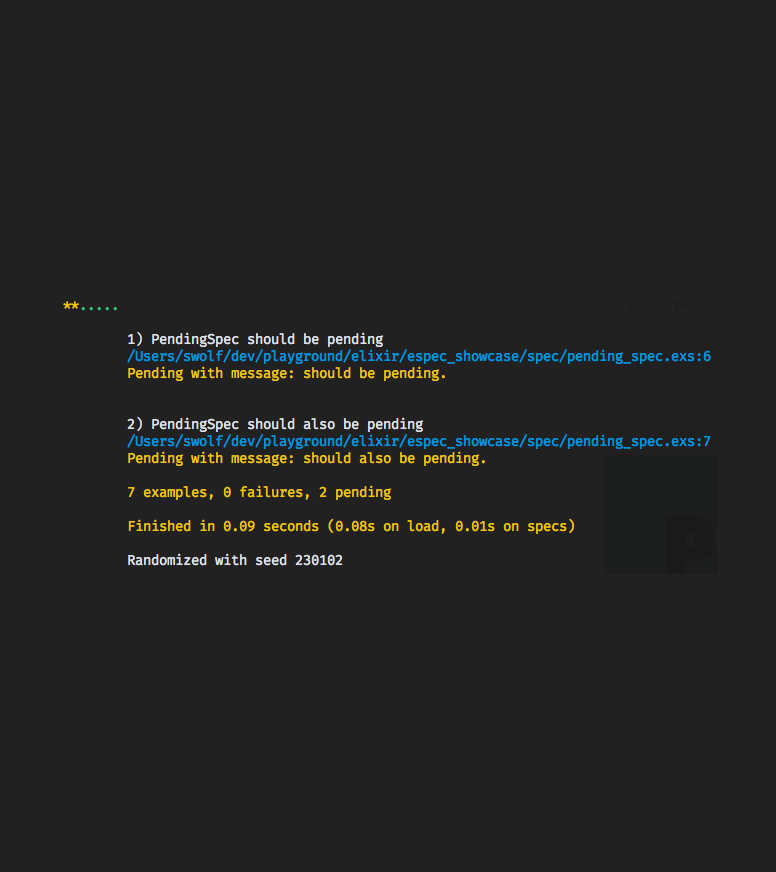

theme: Next, 3

# [fit] ESpec

---

# ESpec

- BDD testing framework
- Inspired by Rubys RSpec
- Not based on ExUnit

^ExUnit is Elixirs baked-in testing framework
^What does BDD mean?

---

# [fit] BDD

__b__ehaviour-__d__riven __d__evelopment

---

# BDD
#### A brief overview

- Extension of __t__est-__d__riven __d__evelopment (__TDD__)
- Simple, __d__omain-__s__pecific __l__anguage (__DSL__)
- Tests describe the behaviour of components
- Tests are derived from the acceptance criteria

^
Tests written as User Stories
For example: Cucumber

---

# BDD
#### Spec-based testing

- A more technical approach
- Alternative to free-form unit testing
- Describe components in an english-like DSL

---

# ESpec
#### An overview

- Organization with `describe`, `context` and `it` blocks
- `before` and `finally` blocks
- Wide variety of matchers (`eq`, `be_integer`, `have`)
- `let` to define memoizable functions

^
*memoizable* means that it only evaluates once when first called

---

# [fit] Example

---

# Roman Numerals
#### ExUnit

```elixir
defmodule RomanNumeralsTest do
  use ExUnit.Test

  test "1 is converted to I" do
    assert RomanNumerals.convert(1) == "I"
  end
end
```

---

# Roman Numerals
#### ESpec

```elixir
defmodule RomanNumeralsSpec do
  use ESpec

  describe ".convert" do
    it "should convert 1 to I" do
      expect(RomanNumerals.convert(1)).to eq("I")
    end
  end
end
```

---

# Roman Numerals
#### ESpec

ESpec allows us to write expectations in __three__ ways:

```elixir, [.highlight: 6, 10, 14]
defmodule RomanNumeralsSpec do
  use ESpec

  describe ".convert" do
    it "should convert 1 to I" do
      expect(RomanNumerals.convert(1)).to eq("I")
    end

    it "should convert 7 to VII" do
      expect RomanNumerals.convert(7) |> to(eq "VII")
    end

    it "should convert 10 to X" do
      RomanNumerals.convert(10) |> should(eq "X")
    end
  end
end
```

^
1. identical to RSpec
2. Elixir version
3. Shortcut

---

# [fit] Increase the complexity

---

# Blog

- Can have multiple articles
- Each article can have comments
<br>
<br>
<br>

__Let's focus on comments__

^
If asked for, there is an equivalent implementation using ExUnit

---

```elixir
defmodule BlogSpec do
  use ESpec

  describe ".comments_for_article" do
    let comments_result: Blog.comments_for_article(article())

    let_ok comments: comments_result()

    context "for a non-existing article" do
      let article: nil

      it "should return an error tuple" do
        comments_result() |> should(be_error_result())
      end
    end

    context "for a new article" do
      let article: insert_article()

      it "should return no comments" do
        comments() |> should(be_empty())
      end
    end

    context "for an article with 10 comments" do
      let article: insert_article()

      before do
        for _ <- 1..10, do: insert_comment_for_article(article())
      end

      it "should return 10 comments" do
        comments() |> should(have_count 10)
      end
    end
  end
end
```

^
Let's assume we have the `create` functions defined somewhere

---

# [fit] What is going on here?

---

```elixir, [.highlight: 5-7]
defmodule BlogSpec do
  use ESpec

  describe ".comments_for_article" do
    let comments_result: Blog.comments_for_article(article())

    let_ok comments: comments_result()

    context "for a non-existing article" do
      let article: nil

      it "should return an error tuple" do
        comments_result() |> should(be_error_result())
      end
    end

    context "for a new article" do
      let article: insert_article()

      it "should return no comments" do
        comments() |> should(be_empty())
      end
    end

    context "for an article with 10 comments" do
      let article: insert_article()

      before do
        for _ <- 1..10, do: insert_comment_for_article(article())
      end

      it "should return 10 comments" do
        comments() |> should(have_count 10)
      end
    end
  end
end
```

---

```elixir, [.highlight: 9-15]
defmodule BlogSpec do
  use ESpec

  describe ".comments_for_article" do
    let comments_result: Blog.comments_for_article(article())

    let_ok comments: comments_result()

    context "for a non-existing article" do
      let article: nil

      it "should return an error tuple" do
        comments_result() |> should(be_error_result())
      end
    end

    context "for a new article" do
      let article: insert_article()

      it "should return no comments" do
        comments() |> should(be_empty())
      end
    end

    context "for an article with 10 comments" do
      let article: insert_article()

      before do
        for _ <- 1..10, do: insert_comment_for_article(article())
      end

      it "should return 10 comments" do
        comments() |> should(have_count 10)
      end
    end
  end
end
```

---

```elixir, [.highlight:17-23]
defmodule BlogSpec do
  use ESpec

  describe ".comments_for_article" do
    let comments_result: Blog.comments_for_article(article())

    let_ok comments: comments_result()

    context "for a non-existing article" do
      let article: nil

      it "should return an error tuple" do
        comments_result() |> should(be_error_result())
      end
    end

    context "for a new article" do
      let article: insert_article()

      it "should return no comments" do
        comments() |> should(be_empty())
      end
    end

    context "for an article with 10 comments" do
      let article: insert_article()

      before do
        for _ <- 1..10, do: insert_comment_for_article(article())
      end

      it "should return 10 comments" do
        comments() |> should(have_count 10)
      end
    end
  end
end
```

---

```elixir, [.highlight:25-35]
defmodule BlogSpec do
  use ESpec

  describe ".comments_for_article" do
    let comments_result: Blog.comments_for_article(article())

    let_ok comments: comments_result()

    context "for a non-existing article" do
      let article: nil

      it "should return an error tuple" do
        comments_result() |> should(be_error_result())
      end
    end

    context "for a new article" do
      let article: insert_article()

      it "should return no comments" do
        comments() |> should(be_empty())
      end
    end

    context "for an article with 10 comments" do
      let article: insert_article()

      before do
        for _ <- 1..10, do: insert_comment_for_article(article())
      end

      it "should return 10 comments" do
        comments() |> should(have_count 10)
      end
    end
  end
end
```

---

# [fit] What else?

---

# Configuration

- `async`: Run your tests in parallel
- `focus`: Run only focused tests using the `--focus` cli option
- `skip`: Skip the tests

---

# Configuration
#### Example

```elixir
defmodule ConfigurationSpec do
  use ESpec, async: true

  it "should be skipped", skip: true do
    5 |> should(be_between 4, 6)
  end

  it "should be skipped with reason" , skip: "Reason" do
    "abc" |> should(have "a")
  end

  it "should be focused", focus: true do
    4.5 |> should(be_close_to 4.3, 0.5)
  end

  context "run synchronously", async: false do
    before do: modify_the_global_state()

    it do: global_state() |> should(eq :hello_world)
  end
end
```

---

# Shortcuts

| Focus | Skip |
| :---: | :---: |
| `fdescribe` |  `xdescribe` |
| `fcontext` | `xcontext` |
| `fit` | `xit` |

---

## Pending examples

- `it` or `pending` with a description
- Listed when executing tests
- Can be used in a TODO-like manner

<br>

```elixir
defmodule PendingSpec
  use ESpec

  it "should be pending"
  pending "should also be pending"
end
```



---

# Shared Examples
#### A DRY approach to testing<br><br>

```elixir
defmodule HelloWorldSharedSpec do
  use ESpec, shared: true

  let_overridable :hello

  it do: hello() |> should(eq "world")
end
```

---

# Shared Examples
#### A DRY approach to testing<br><br>

```elixir
defmodule HelloWorldSpec do
  use ESpec

  let hello: "world"

  it_behaves_like HelloWorldSharedSpec
end
```

---

# Generated Examples

```elixir
defmodule RomanNumeralsSpec do
  use ESpec

  numerals = %{
    1 => "I",
    10 => "X",
    7 => "VII",
    3 => "III",
    11 => "XI",
    16 => "XVI",
    1216 => "MCCXVI",
  }

  describe ".convert" do
    let result: RomanNumerals.convert(number())

    for {number, numeral} <- statuses do
      context "given #{inspect number}" do
        let number: unquote(number)
        let numeral: unquote(numeral)

        it "should return #{numeral}" do
          result() |> should(eq numeral())
        end
      end
    end
  end
end
```

---

# Generated Examples

```elixir, [.highlight: 4-12, 17-26]
defmodule RomanNumeralsSpec do
  use ESpec

  numerals = %{
    1 => "I",
    10 => "X",
    7 => "VII",
    3 => "III",
    11 => "XI",
    16 => "XVI",
    1216 => "MCCXVI",
  }

  describe ".convert" do
    let result: RomanNumerals.convert(number())

    for {number, numeral} <- statuses do
      context "given #{inspect number}" do
        let number: unquote(number)
        let numeral: unquote(numeral)

        it "should return #{numeral}" do
          result() |> should(eq numeral())
        end
      end
    end
  end
end
```

---

# Mocking

ESpec ships with Meck to mock functions

```elixir
defmodule MockSpec do
  use ESpec

  before do
    allow SomeModule |> to(accept :func, fn(a, b) -> a + b end)
  end

  it do: SomeModule.func(1, 2) |> should(eq 3)
end
```