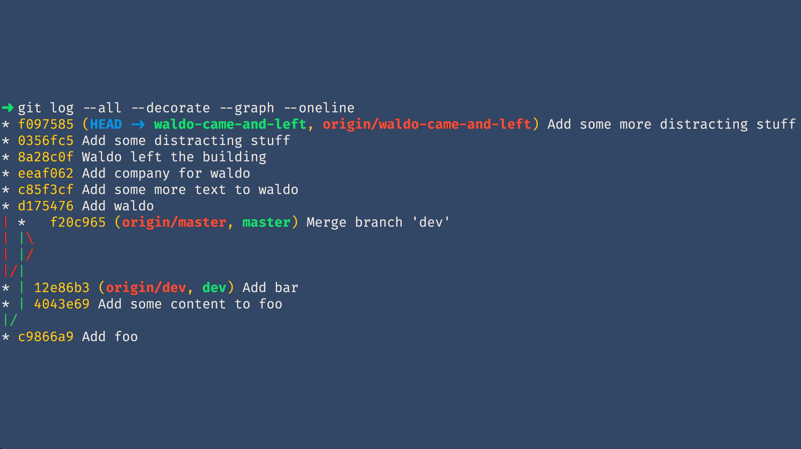

theme: Next, 1

# GIT GUD

---
[.build-lists: true]

# Agenda

1. Background
2. Basics
3. Advanced
4. Tips & Tricks
5. Best Practices

^
1. & 2. => Lecture
3. & 4. => Interactive
5. => Lecture

---

# Background
### What is `Git`?

^
Ask this question?

---

# VCS
### Version Control System

^
What does a VCS do?

---

> [...] a system that records changes to a file or set of files over time
-- Scott Chacon & Ben Straub [^ProGit]

---

## Version Control Systems

- `CVS`
- `Perforce`
- `SVN`
- `Mercurial`
- `Git`

^
Who has tried what?
Later: How they differ

---

# Open Source
### GNU GPL2

^
published under GNU General Public License version 2
^
Next Slide: What makes Git different from, for example, SVN

---

# Distributed

^
What does that mean? For this we have understand:

---

# Centralised
### VS
# Distributed

---

# Centralised


^
- Central repository = Single source of truth
- Server/Client communication

^
Examples: SVN, CVS, Perforce

---

# Distributed


^
- Each repository a full backup (with exceptions)
- Communication between repositories
- Possibel to do centralised approach (usual approach)

^
Examples: Git, Mercurial

---

# Basics

^
Who has more SVN than Git experience?
=> You'll be trouble

^
I could bore with commands, but you probably know those already.
Let's talk about how Git works internally => Helps a lot for advanced stuff
- Terminology
- Object model

---

# Expected Knowledge

- `add`
- `reset`
- `commit`
- `merge`

---


^
How to add changes? (Probably familiar with this)
Follow up: How does Git track changes?

---

## How does `Git` track changes?

---

# `Git` is different

^
Not only "Distributed"
=> The way `Git` thinks about it's files

---

> The major difference [...] is the way Git thinks about its data.
-- Scott Chacon & Ben Straub [^ProGit]

---

# Snapshots
## not
# Deltas


^
Deltas: What changed?
Snapshots: Current state
Q: Any advantages you can think of?

^
How does Git build this to a commit?

---

### *What is a*
# Commit

---


^
Commit -> Tree -> Tree | BLOB
Commit: Tree + Parents + Metadata

^
Git is closer to a filesystem then to a classic VCS
Next slide: How does Git identify objects?

---

# SHA1

^
Hash built over all properties of the object (Commit => Author, Committer etc.)
You might have heard to never change commits after pushing: Hash changes when properties change

---

# Try it out!

---

## Clone workshop repository
### `git clone`
### `git@github.gcxi.de:swolf/git-workshop.git`


---

```
$ cd git-workshop

$ echo 'Some random text' > my_file

$ git hash-object -w my_file
1a76b8a41993e2c667f5b191fb57abdab2102a8b

$ git cat-file -t 1a76b8a41993e2c667f5b191fb57abdab2102a8b
blob

$ git cat-file -p 1a76b8a41993e2c667f5b191fb57abdab2102a8b
Some random text
```

^
You can actually find the blob in .git/objects/1a/76b8a41993e2c667f5b191fb57abdab2102a8b
Git only uses the content; create an identical file and the hash will be the same

---

# How history is made
### `Git` history at least



---


^
Each commit has a reference on it's parent => Single linked list
Not really single though ...

---

# Honour thy parents
### Navigate through history


^
Q: You want to remove the last commit, how?

---

# `^`
### *and*
#`~<N>`

---


^
Better have an example

---

```
$ git checkout ancestry
...

$ git log --oneline -1 HEAD
822eca1 Add the number 5 to numbers

$ git log --oneline -1 HEAD^
d4bd446 Add the number 4 to numbers

$ git log --oneline -1 HEAD^^
1b94d52 Add the number 3 to numbers

$ git log --oneline -1 HEAD~2
1b94d52 Add the number 3 to numbers
```

---

### *What is a*
# Branch

^
Q: Ask this!

---

# Let's take a look

<br/><br/><br/>

```
$ ls -l .git/refs/heads
total 32
-rw-r--r--  1 swolf  staff  41 Jan 16 09:06 ancestry
-rw-r--r--  1 swolf  staff  41 Jan 16 07:00 dev
-rw-r--r--  1 swolf  staff  41 Jan 16 07:00 master
-rw-r--r--  1 swolf  staff  41 Jan 16 07:02 waldo-came-and-left
```

^
All references in `.git/refs`:
- branches in `heads`
- remote branches in `remotes/<remote-name>`
- tags in `tags`

---

# Huh, `master` is a file ...

^
Q: What do you think is in master?

---

# I wonder what's in there ...

```
$ cat .git/refs/heads/master
f20c96538c6dca6fb37e631388814fe941afc2ae
```

---

# It's just a hash!

^
Let us inspect the object!
We can use `git cat-file --batch`

---

```
$ cat .git/refs/heads/master | git cat-file --batch
f20c96538c6dca6fb37e631388814fe941afc2ae commit 540
tree 9ab6d12a4587fb4a02de1b5e745277c6c832cf5a
parent c9866a994539e01938ceec6c75ada013ce456e9b
parent 12e86b3370f931c423022a8c8d7d7fa7413e0bc4
author Sascha Wolf <sascha.wolf@grandcentrix.net> 1516082444 +0100
committer Sascha Wolf <sascha.wolf@grandcentrix.net> 1516082444 +0100
gpgsig -----BEGIN PGP SIGNATURE-----

 iHUEABEIAB0WIQTQyMji07ff76Vkk26j80vFo8w6AAUCWl2VDAAKCRCj80vFo8w6
 AOqtAPoCPrGCN1QZKKGmlqZu43n824v2wviWbUujd9CBwuUURQD/dn2EJ2zHi+zQ
 qBKm1cfsi5vwTiYj31O4UbOZ1rJbW1M=
 =vi7g
 -----END PGP SIGNATURE-----

Merge branch 'dev'
```

---

# What about `HEAD`?

^
Q: What do you think is HEAD?
Q: Have you ever seen "detached HEAD"?

---

<br/><br/><br/><br/>

```
$ cat .git/HEAD
ref: refs/heads/master

$ git checkout --detach master
...

$ cat .git/HEAD
f20c96538c6dca6fb37e631388814fe941afc2ae
```

^
1. Reference onto a branch
2. Reference onto a commit (detached HEAD)

---

### *What is a*
# Merge

^
Q: How does a merge differ from a usual commit?

---

# What does the log tell us?

<br/>

```
$ git log --decorate --graph --oneline
*   f20c965 (origin/master, master) Merge branch 'dev'
|\
| * 12e86b3 (origin/dev, dev) Add bar
| * 4043e69 Add some content to foo
|/
* c9866a9 Add foo
```

---

## Remember the commit object?

---

```
$ cat .git/refs/heads/master | git cat-file --batch
f20c96538c6dca6fb37e631388814fe941afc2ae commit 540
tree 9ab6d12a4587fb4a02de1b5e745277c6c832cf5a
parent c9866a994539e01938ceec6c75ada013ce456e9b
parent 12e86b3370f931c423022a8c8d7d7fa7413e0bc4
author Sascha Wolf <sascha.wolf@grandcentrix.net> 1516082444 +0100
committer Sascha Wolf <sascha.wolf@grandcentrix.net> 1516082444 +0100
gpgsig -----BEGIN PGP SIGNATURE-----

 iHUEABEIAB0WIQTQyMji07ff76Vkk26j80vFo8w6AAUCWl2VDAAKCRCj80vFo8w6
 AOqtAPoCPrGCN1QZKKGmlqZu43n824v2wviWbUujd9CBwuUURQD/dn2EJ2zHi+zQ
 qBKm1cfsi5vwTiYj31O4UbOZ1rJbW1M=
 =vi7g
 -----END PGP SIGNATURE-----

Merge branch 'dev'
```

^
Q: Do you notice something?
=> Two parents

---

# Advanced
### From porcelain to plumbing

^
Porcelain: Clean CLI commands (like add, commit, reset)
Plumbing: Programmatically used low-level commands

---

# Porcelain
#### add | reset | commit | merge | pull | push

---

# Plumbing
#### cat-file | update-index | write-tree | commit-tree

---

# We're going to look at

- `--patch` mode
- `stash`
- `rebase`
- `submodule`
- `for-each-ref`
- `update-index` (--assume-unchanged | --skip-worktree)

---

## One thing before we start ...

^
Use aliases for intersting command+option combinations

---

# Aliase
#### `git config --global alias.<your-alias> <command>``

---

# In Action

<br/>

```
$ git config --global alias.l 'log --decorate --graph --oneline'

$ git l -3
*   f20c965 (HEAD -> master, origin/master) Merge branch 'dev'
|\
| * 12e86b3 (origin/dev, dev) Add bar
| * 4043e69 Add some content to foo
|/
```

^
`--global` to put it into your `~/.gitconfig`

---

# `--patch`
### `add` | `reset`

---

# Let's try it out!

<br/>

```
$ git checkout patch-practice
...

$ git apply patch-practice.diff
...

$ git add --patch # Try to add only the above line!
```

^
Tip 1: `?` for help
Tip 2: `s` for split

---

# Level up your `--patch`
## `e`dit mode

^
It's possible to edit things before adding it to the index!
=> Show it on the example patch

---

# `git stash`
## quicksave for git

^
Q: Who knows this already?

---

# `git stash`

<br/>

- `push` create a stash from current changes
- `pop` apply and delete a stash
- `drop` delete a stash

<br/>
<br/>

Use `stash@{<n>}` to reference older stashes

---

- (`add`|`reset`) `--patch`
- `stash`
- `rebase`
- `submodule`
- `for-each-ref`
- `update-index` (--assume-unchanged | --skip-worktree)

---

# `git rebase`
### *one command to rule them all*


---

# Honourable mentions

- `bisect`: find the commit which introduced an error
- `cherry-pick`: "copy" one+ commits onto the current branch
- `clean`: remove untracked files and folders
- `grep`: search pattern in tracked files
- `reflog`: checkout history for `HEAD` or a branch
- `worktree`: checkout a reference into another worktree

---

# `git bisect`
### A smart bug hunters weapon

---

# Best Practices

---

- Commit message
- Merging and rebasing
- Branching?

---

# Tables

With `:---:`, `---:` and `:---` you can center, right or right align the cell content.

  Header 1 |    Header 2   |   Header 3   |
-----------| :-----------: | -----------: |
Cell       |     _Cell_    |     *Cell*
Cell       |   **Cell**    |     __Cell__

[^ProGit]: https://git-scm.com/book/en/v2