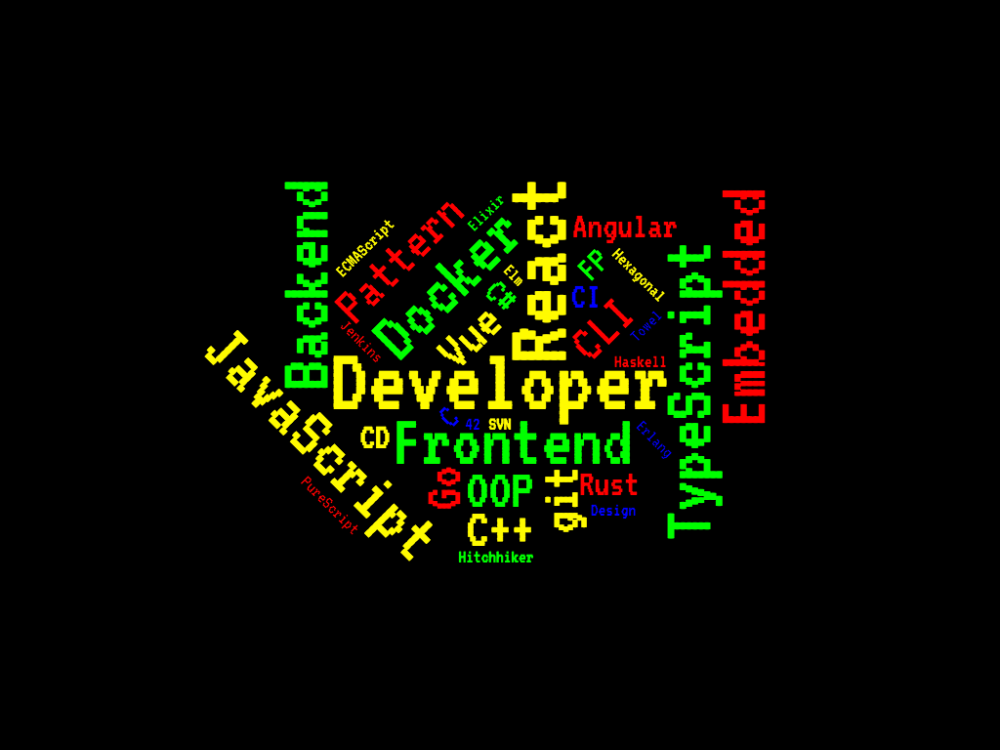
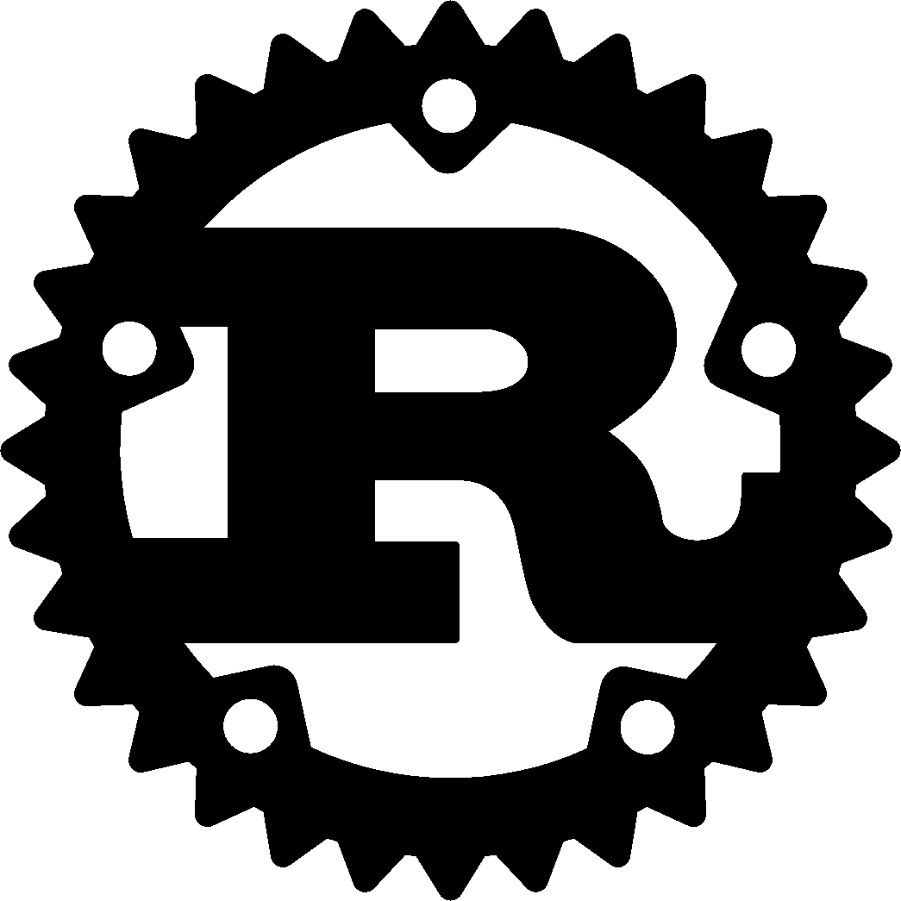

build-lists: true
theme: Terminal

# [fit] You Know Nothing
### or do you?

^
Tried to make accessible: Give me feedback! (Thanks to organizers!)

^
Ask: Who in this room is not a dev?
Talk: From a perspective of a dev; gist is applicable regardless of profession, don't feel excluded!

^
This is a talk about ...

---

^
Jon Snow and how he knew nothing ...

^
No I'm kidding of course. You knew there would be a GoT joke.

---
# Knowledge Sharing

^
What is it?
- Writing blog posts
- Answering Questions
- Recording videos or podcasts
- Speaking on conferences
- Teaching your colleagues

^
Agree that it's important
We all rely on it, colleagues, or through platforms such as ...

---
[.background-color: #ffffff]

^
Stats (2016)
- 7.5 mil posts

^
A lot of them are free

^
We all found a helpful article on medium

---
[.background-color: #ffffff]

^
Stats (December 2018) (https://en.wikipedia.org/wiki/Wikipedia:Size_of_Wikipedia)
- ~35 mil registered users
- nearly 47 mil articles (total)
- nearly 6 mil english articles

---
[.background-color: #ffffff]

^
Devs here: I think we all rely on it
85% of devs say they visit StackOverflow at least a few times a week

^
Stats (29. December 2018)
- nearly 10 mil users
- 26 mil answers for nearly 17 mil questions

^
Lots of volunteers who share their knowledge; or close your question as a duplicate

<!--
Users: https://data.stackexchange.com/stackoverflow/query/954537/number-of-users
Answers: https://data.stackexchange.com/stackoverflow/query/954535/number-of-answers
Questions: https://data.stackexchange.com/stackoverflow/query/954525/number-of-questions
Dev Usage: https://insights.stackoverflow.com/survey/2018/#community-visiting-stack-overflow
Questions without answers: https://data.stackexchange.com/stackoverflow/query/954533/number-of-questions-without-a-single-answer
-->

---

^
That's a lot of knowledge

---
# __Intimidating__

^
You read these articles or answers and these people seem so smart.
What could we possibly contribute? Right?

^
We already struggle to keep up

---

^
So. Much. To. Learn.

^
Then we try to keep up and maybe ask people questions and they tell us:

---
[.background-color: #ffffff]
[.header: #000000, IBM 3270 Narrow]

# "You're doing
#                    
# it wrong!"

^
This forms our perception of the job as a dev; we could come to the conclusion that a great dev knows all that

---
# A Great Developer

- Awesome tech skills
- Incredible productivity
- High quality code
- Blazing fast learner
- Some Soft skills

^
At the end it's all about the output, right?

^
So we're thinking ...

---
# *Keep learning*

^
So we can become great devs and at some point have something to share

^
When we're doing that, we're trying to avoid ...

---
## We're afraid of
# __Embarrassment__

^
All boils down to this
We don't want to be "that person"

---
# So we __don't__ ...

- answer that StackOverflow question
- do that talk on that meetup
- offer that help to someone
- prepare that workshop
- record that video
- write that blog post
- give input during that meeting

---
# Who could blame us?

---
## We're working in a
# __fast__ moving
## industry

^
Which means, we're pressured to

---
# Perform
# __and__
# Learn

^
Both at the same time; this stresses us out
So we just don't do it. Maybe we write a blog post but never publish it

---
# Sounds familiar?

^
Ask to raise hands?
Welcome to the club

---
[.autoscale: true]

# Hi, I'm Sascha

- Full Stack Developer / TSA
- @grandcentrix in Cologne, Germany
- During my career I:
  + wrote backend services in Java and NodeJS
  + created responsive websites with CSS, Vue, and Elm
  + shaped iOS apps with Objective-C and Swift
  + did some embedded development in C
  + built big backend systems with Elixir
- I know my way around: git, CLI magic, Clean Code, DDD, TDD, and more ...

^
Few facts about me

---
# My Story

[.footer: Photo by Daniel McCullough on Unsplash]
[.footer-style: alignment(right)]

^
Because Buzzkill: This doesn't end!
There is always something you don't know

^
Always absorbed knowledge as I could; I'm good at it

---
# Exhaustion

[.footer: Photo by Tim Gouw on Pexels]
[.footer-style: alignment(right)]

^
But I kept pushing; I put even more on my plate (MCSE certification)

---
# Depression

[.footer: Photo by Sasha Freemind on Unsplash]
[.footer-style: alignment(right)]

^
I came home and slumped on the couch;
My wife repeatedly asked me to go into

---
# Therapy

[.footer: Photo by rawpixel on Unsplash]
[.footer-style: alignment(right)]

^
For over a year now and still working on it
Today I'm here to tell you what I painfully learned, so you don't make the same mistakes

^
See, I didn't suddenly know everything but instead I developed ...

---
[.header: line-height(0.7), text-scale(1.2), IBM 3270 Narrow]
[.header-emphasis: #2C3850, line-height(0.7), text-scale(1.2), Trim Poster]

# [fit] A New
# [fit] *Frame of Mind*

^
- I changed my perspective on my work
- In the next few slides I'm gonna try to convey it
- We're gonna make some small detours
- Stick with me it's all gonna come back to Knowledge Sharing

---
[.background-color: #47B386]
[.footer-style: #FFF186, Trim Poster, alignment(right), line-height(0.8), text-scale(1.0)]
[.text: #2C3850, line-height(1.1), text-scale(1.0), Trim Mono]
[.text-emphasis: #F2EEE7]
[.text-strong: Trim Mono Bold]
[.header: #2C3850, line-height(0.7), text-scale(1.2), Trim Poster]
[.header-emphasis: Trim Poster ExtraCompressed]
[.header-strong: Trim Poster Expanded]
[.link: #FFF186]
[.list: bullet-character(» )]

## We focus a lot on
# Tech Skills

^
Patterns, Languages, Performance etc. etc.

---
[.background-color: #47B386]
[.footer-style: #FFF186, Trim Poster, alignment(right), line-height(0.8), text-scale(1.0)]
[.text: #2C3850, line-height(1.1), text-scale(1.0), Trim Mono]
[.text-emphasis: #F2EEE7]
[.text-strong: Trim Mono Bold]
[.header: #2C3850, line-height(0.7), text-scale(1.2), Trim Poster]
[.header-emphasis: Trim Poster ExtraCompressed]
[.header-strong: Trim Poster Expanded]
[.link: #FFF186]
[.list: bullet-character(» )]

# Code Ninja
## &
# Rockstar Dev

^
But what does that actually tells us about a person?

^
See, we look at this tiny part

---
[.background-color: #ffffff]
[.footer-style: #FFF186, Trim Poster, alignment(right), line-height(0.8), text-scale(1.0)]
[.text: #2C3850, line-height(1.1), text-scale(1.0), Trim Mono]
[.text-emphasis: #F2EEE7]
[.text-strong: Trim Mono Bold]
[.header: #2C3850, line-height(0.7), text-scale(1.2), Trim Poster]
[.header-emphasis: Trim Poster ExtraCompressed]
[.header-strong: Trim Poster Expanded]
[.link: #FFF186]
[.list: bullet-character(» )]

[.footer: Photo by Shane Aldendorff from Pexels]

^
Based on that we come to a judgement: "This is a great dev, he really knows his JS!"

^
We lose sight of the other parts ...

---
[.background-color: #ffffff]
[.footer-style: #FFF186, Trim Poster, alignment(right), line-height(0.8), text-scale(1.0)]
[.text: #2C3850, line-height(1.1), text-scale(1.0), Trim Mono]
[.text-emphasis: #F2EEE7]
[.text-strong: Trim Mono Bold]
[.header: #2C3850, line-height(0.7), text-scale(1.2), Trim Poster]
[.header-emphasis: Trim Poster ExtraCompressed]
[.header-strong: Trim Poster Expanded]
[.link: #FFF186]
[.list: bullet-character(» )]

[.footer: Photo by Shane Aldendorff from Pexels]

^
But there is more to a person than just his ability to write JS!
And only everything put together forms a whole person!

---
[.background-color: #ffffff]
[.footer-style: #FFF186, Trim Poster, alignment(right), line-height(0.8), text-scale(1.0)]
[.text: #2C3850, line-height(1.1), text-scale(1.0), Trim Mono]
[.text-emphasis: #F2EEE7]
[.text-strong: Trim Mono Bold]
[.header: #2C3850, line-height(0.7), text-scale(1.2), Trim Poster]
[.header-emphasis: Trim Poster ExtraCompressed]
[.header-strong: Trim Poster Expanded]
[.link: #FFF186]
[.list: bullet-character(» )]

[.footer: Photo by Markus Spiske from Pexels]

^
And only put together they form a person greater than the sum of their parts

^
Prepackaged; all together

^
Let's do a little experiment

---
[.background-color: #47B386]
[.footer-style: #FFF186, Trim Poster, alignment(right), line-height(0.8), text-scale(1.0)]
[.text: #2C3850, line-height(1.1), text-scale(1.0), Trim Mono]
[.text-emphasis: #F2EEE7]
[.text-strong: Trim Mono Bold]
[.header: #2C3850, line-height(0.7), text-scale(1.2), Trim Poster]
[.header-emphasis: Trim Poster ExtraCompressed]
[.header-strong: Trim Poster Expanded]
[.link: #FFF186]
[.list: bullet-character(» )]

### Think of somebody you
# respect

^
Can be a colleague, blogger, youtuber, etc.

^
Ask yourself: What exactly do you respect about them?

---
[.background-color: #47B386]
[.footer-style: #FFF186, Trim Poster, alignment(right), line-height(0.8), text-scale(1.0)]
[.text: #2C3850, line-height(1.1), text-scale(1.0), Trim Mono]
[.text-emphasis: #F2EEE7]
[.text-strong: Trim Mono Bold]
[.header: #2C3850, line-height(0.7), text-scale(1.2), Trim Poster]
[.header-emphasis: Trim Poster ExtraCompressed]
[.header-strong: Trim Poster Expanded]
[.link: #FFF186]
[.list: bullet-character(» )]

## Which qualities do you respect?

- Writes awesome code?
- Great communication skills?
- Empathic and patient?
- Fun to interact with?
- Interested in a variety of topics?
- Prompts you to learn new things?
- Probably lots of other things!

^
Code: Only that? Or maybe more?

^
The point I'm trying to make: Rarely only tech skills which we respect!

---
[.background-color: #ffffff]
[.footer-style: #FFF186, Trim Poster, alignment(right), line-height(0.8), text-scale(1.0)]
[.text: #2C3850, line-height(1.1), text-scale(1.0), Trim Mono]
[.text-emphasis: #F2EEE7]
[.text-strong: Trim Mono Bold]
[.header: #2C3850, line-height(0.7), text-scale(1.2), Trim Poster]
[.header-emphasis: Trim Poster ExtraCompressed]
[.header-strong: Trim Poster Expanded]
[.link: #FFF186]
[.list: bullet-character(» )]

### We're more than a walking
# Tech Stack

[.footer: Photo by Eli Francis on Unsplash]

^
First check @GCX: Does this person fit as a person?
Tech also important, but secondary

^
We are a small company but there is a big one who also found that out:

---
[.background-color: #ffffff]
[.footer-style: #fff186, trim poster, alignment(right), line-height(0.8), text-scale(1.0)]
[.text: #2c3850, line-height(1.1), text-scale(1.0), trim mono]
[.text-emphasis: #f2eee7]
[.text-strong: trim mono bold]
[.header: #2c3850, line-height(0.7), text-scale(1.2), trim poster]
[.header-emphasis: trim poster extracompressed]
[.header-strong: trim poster expanded]
[.link: #fff186]
[.list: bullet-character(» )]

^
- Google had the same realization!
- Teams with super-smart people, they didn't perform
- Why? Research project in 2012, asking a simple question:

---
[.background-color: #47b386]
[.footer-style: #fff186, trim poster, alignment(right), line-height(0.8), text-scale(1.0)]
[.text: #2c3850, line-height(1.1), text-scale(1.0), trim mono]
[.text-emphasis: #f2eee7]
[.text-strong: trim mono bold]
[.header: #2c3850, line-height(0.7), text-scale(1.2), trim poster]
[.header-emphasis: trim poster extracompressed]
[.header-strong: trim poster expanded]
[.quote: #2C3850, line-height(0.7), text-scale(0.9), Trim Mono]
[.quote-author: #FFF186, line-height(0.7), text-scale(1.0), Trim Mono]
[.link: #fff186]
[.list: bullet-character(» )]

> What's the secret to a successful team?
-- Google (Project Aristotle)

^
2 years of research
- 200+ interviews (employees)
- 180+ active teams
- 250 different attributes

^
In the end it boiled down to something called:

---
[.background-color: #47B386]
[.footer-style: #FFF186, Trim Poster, alignment(right), line-height(0.8), text-scale(1.0)]
[.text: #2C3850, line-height(1.1), text-scale(1.0), Trim Mono]
[.text-emphasis: #F2EEE7]
[.text-strong: Trim Mono Bold]
[.header: #2C3850, line-height(0.7), text-scale(1.2), Trim Poster]
[.header-emphasis: Trim Poster ExtraCompressed]
[.header-strong: Trim Poster Expanded]
[.link: #FFF186]
[.list: bullet-character(» )]

# Psychological
# Safety

---
[.background-color: #47B386]
[.footer-style: #FFF186, Trim Poster, alignment(right), line-height(0.8), text-scale(1.0)]
[.footnote: #FFF186, Trim Mono, line-height(0.8), text-scale(0.8)]
[.text: #2C3850, line-height(1.1), text-scale(1.0), Trim Mono]
[.text-emphasis: #F2EEE7]
[.text-strong: Trim Mono Bold]
[.header: #2C3850, line-height(0.7), text-scale(1.2), Trim Poster]
[.header-emphasis: Trim Poster ExtraCompressed]
[.header-strong: Trim Poster Expanded]
[.quote: #2C3850, line-height(1.0), text-scale(1.3), Trim Mono]
[.quote-author: #FFF186, line-height(1.3), text-scale(1.0), Trim Mono]
[.link: #FFF186]
[.list: bullet-character(» )]

# Psychological Safety

> [the] shared belief held by members of a team that the team is safe for interpersonal risk-taking. [...]
> A sense of confidence that the team will not embarrass, reject or punish someone for speaking up.
-- Amy Edmondson (Harvard Business School)[^1]

[^1]: https://www.nytimes.com/2016/02/28/magazine/what-google-learned-from-its-quest-to-build-the-perfect-team.html

^
What does that mean?
- A protected environment to exchange ideas
- Healthy culture around failure
- A lot more things: article from NY Times!

^
Great article from the NYT

^
Not the smartest people build the best teams!
But teams with strong:

---
[.background-color: #47b386]
[.footer-style: #fff186, Trim Poster, alignment(right), line-height(0.8), text-scale(1.0)]
[.footnote: #FFF186, Trim Mono, line-height(0.8), text-scale(0.8)]
[.text: #2c3850, line-height(1.1), text-scale(1.0), Trim Mono]
[.text-emphasis: #f2eee7]
[.text-strong: Trim Mono Bold]
[.header: #2c3850, line-height(0.7), text-scale(1.2), Trim Poster]
[.header-emphasis: Trim Poster ExtraCompressed]
[.header-strong: Trim Poster Expanded]
[.link: #fff186]
[.list: bullet-character(» )]

# Soft Skills

^
Not only in tech! This applies to every industry!

^
When these skills are so important, maybe we should call them:

---
[.background-color: #47b386]
[.footer-style: #fff186, Trim Poster, alignment(right), line-height(0.8), text-scale(1.0)]
[.footnote: #FFF186, Trim Mono, line-height(0.8), text-scale(0.8)]
[.text: #2c3850, line-height(1.1), text-scale(1.0), Trim Mono]
[.text-emphasis: #f2eee7]
[.text-strong: Trim Mono Bold]
[.header: #2c3850, line-height(0.7), text-scale(1.2), Trim Poster]
[.header-emphasis: Trim Poster ExtraCompressed]
[.header-strong: Trim Poster Expanded]
[.link: #fff186]
[.list: bullet-character(» )]

^
Pretty much everybody needs them and you need them for pretty much everything

^
Most projects fail due to human reasons

^
So, Core Skills matter but ...

---
[.background-color: #47B386]
[.footer-style: #FFF186, Trim Poster, alignment(right), line-height(0.8), text-scale(1.0)]
[.text: #2C3850, line-height(1.1), text-scale(1.0), Trim Mono]
[.text-emphasis: #F2EEE7]
[.text-strong: Trim Mono Bold]
[.header: #2C3850, line-height(0.7), text-scale(1.2), Trim Poster]
[.header-emphasis: Trim Poster ExtraCompressed]
[.header-strong: Trim Poster Expanded]
[.link: #FFF186]
[.list: bullet-character(» )]

# Why stop here?

^
Core Skills, Tech Skills, why not other skills?

^
I'm talking about skills aquired through things we in our freetime.
For me:

---
[.background-color: #ffffff]
[.footer-style: #fff186, Trim Poster, alignment(right), line-height(0.8), text-scale(1.0)]
[.footnote: #FFF186, Trim Mono, line-height(0.8), text-scale(0.8)]
[.text: #2c3850, line-height(1.1), text-scale(1.0), Trim Mono]
[.text-emphasis: #f2eee7]
[.text-strong: Trim Mono bold]
[.header: #2c3850, line-height(0.7), text-scale(1.2), Trim Poster]
[.header-emphasis: Trim Poster ExtraCompressed]
[.header-strong: Trim Poster Expanded]
[.link: #fff186]
[.list: bullet-character(» )]

[.footer: Photo by Jamie McInall from Pexels]

^
Played a lot of LoL: Learned to be more calm in a team and stress situations

^
Another area: RPGs

---
[.background-color: #ffffff]
[.footer-style: #fff186, Trim Poster, alignment(right), line-height(0.8), text-scale(1.0)]
[.footnote: #FFF186, Trim Mono, line-height(0.8), text-scale(0.8)]
[.text: #2c3850, line-height(1.1), text-scale(1.0), Trim Mono]
[.text-emphasis: #f2eee7]
[.text-strong: Trim Mono bold]
[.header: #2c3850, line-height(0.7), text-scale(1.2), Trim Poster]
[.header-emphasis: Trim Poster ExtraCompressed]
[.header-strong: Trim Poster Expanded]
[.link: #fff186]
[.list: bullet-character(» )]

[.footer: Photo by Ian Gonzalez on Unsplash]

^
- Clearer communication
- Patience
- Organization

^
Think about it: What skills did you aquire? I would love to hear about it!

^
Let me reiterate:

---
[.background-color: #47b386]
[.footer-style: #fff186, trim poster, alignment(right), line-height(0.8), text-scale(1.0)]
[.text: #2c3850, line-height(1.1), text-scale(1.0), trim mono]
[.text-emphasis: #f2eee7]
[.text-strong: trim mono bold]
[.header: #2c3850, line-height(0.7), text-scale(1.2), trim poster]
[.header-emphasis: trim poster extracompressed]
[.header-strong: trim poster expanded]
[.link: #fff186]
[.list: bullet-character(» )]

# Tech enables us

^
You definitely need some tech skills to work in this industry

^
BUT

---
[.background-color: #47b386]
[.footer-style: #fff186, trim poster, alignment(right), line-height(0.8), text-scale(1.0)]
[.text: #2c3850, line-height(1.1), text-scale(1.0), trim mono]
[.text-emphasis: #f2eee7]
[.text-strong: trim mono bold]
[.header: #2c3850, line-height(0.7), text-scale(1.2), trim poster]
[.header-emphasis: trim poster extracompressed]
[.header-strong: trim poster expanded]
[.link: #fff186]
[.list: bullet-character(» )]

# Tech does
# __not__
# define us

^
But they don't make you necessarily a great dev

^
Okay, you might now be asking yourself:

---
[.background-color: #47b386]
[.footer-style: #fff186, Trim Poster, alignment(right), line-height(0.8), text-scale(1.0)]
[.footnote: #FFF186, Trim Mono, line-height(0.8), text-scale(0.8)]
[.quote: #2C3850, line-height(0.8), text-scale(0.8), Trim Mono]
[.quote-author: #FFF186, line-height(0.7), text-scale(1.0), Trim Mono]
[.text: #2c3850, line-height(1.1), text-scale(1.0), Trim Mono]
[.text-emphasis: #f2eee7]
[.text-strong: Trim Mono Bold]
[.header: #2c3850, line-height(0.7), text-scale(1.2), Trim Poster]
[.header-emphasis: Trim Poster ExtraCompressed]
[.header-strong: Trim Poster Expanded]
[.link: #fff186]
[.list: bullet-character(» )]

> Why is this guy telling me all of this?
-- Maybe you right now?

^
What does that have to do with knowledge sharing?

^
During therapy I've realized that I:

---
[.background-color: #47b386]
[.footer-style: #fff186, Trim Poster, alignment(right), line-height(0.8), text-scale(1.0)]
[.footnote: #FFF186, Trim Mono, line-height(0.8), text-scale(0.8)]
[.text: #2c3850, line-height(1.1), text-scale(1.0), Trim Mono]
[.text-emphasis: #f2eee7]
[.text-strong: Trim Mono Bold]
[.header: #2c3850, line-height(0.7), text-scale(1.2), Trim Poster]
[.header-emphasis: Trim Poster ExtraCompressed]
[.header-strong: Trim Poster Expanded]
[.link: #fff186]
[.list: bullet-character(» )]

# My value
# =
# My tech skills?

^
I hold myself to unatainable standards

^
Conversations with colleagues = similar, maybe you too?

^
There is a consequence to this:

---
[.background-color: #47b386]
[.footer-style: #fff186, Trim Poster, alignment(right), line-height(0.8), text-scale(1.0)]
[.footnote: #FFF186, Trim Mono, line-height(0.8), text-scale(0.8)]
[.quote: #2C3850, line-height(0.8), text-scale(0.8), Trim Mono]
[.quote-author: #FFF186, line-height(1.3), text-scale(1.0), Trim Mono]
[.text: #2c3850, line-height(1.1), text-scale(1.0), Trim Mono]
[.text-emphasis: #f2eee7]
[.text-strong: Trim Mono Bold]
[.header: #2c3850, line-height(0.7), text-scale(1.2), Trim Poster]
[.header-emphasis: Trim Poster ExtraCompressed]
[.header-strong: Trim Poster Expanded]
[.link: #fff186]
[.list: bullet-character(» )]

> When we define our worth by our tech skills, every critique directly undermines our self-confidence
-- My realization

^
Knowledge Share = Risky
We put ourself out there

---
[.background-color: #ffffff]
[.footer-style: #fff186, Trim Poster, alignment(right), line-height(0.8), text-scale(1.0)]
[.text: #2c3850, line-height(1.1), text-scale(1.0), Trim Mono]
[.text-emphasis: #f2eee7]
[.text-strong: Trim Mono bold]
[.header: #2c3850, line-height(0.7), text-scale(1.2), Trim Poster]
[.header-emphasis: Trim Poster ExtraCompressed]
[.header-strong: Trim Poster Expanded]
[.link: #fff186]
[.list: bullet-character(» )]

[.footer: Photo by Arnold Dogelis on Unsplash]

^
Ofc you can build a house on stilts and it might even hold!

^
But when we recognize = All our skills are important!

---
[.background-color: #ffffff]
[.footer-style: #fff186, Trim Poster, alignment(right), line-height(0.8), text-scale(1.0)]
[.footnote: #FFF186, Trim Mono, line-height(0.8), text-scale(0.8)]
[.text: #2c3850, line-height(1.1), text-scale(1.0), Trim Mono]
[.text-emphasis: #f2eee7]
[.text-strong: Trim Mono bold]
[.header: #2c3850, line-height(0.7), text-scale(1.2), Trim Poster]
[.header-emphasis: Trim Poster ExtraCompressed]
[.header-strong: Trim Poster Expanded]
[.link: #fff186]
[.list: bullet-character(» )]

^
Stable foundation: It's harder to shake you!
When you share, and it's wrong, it's not so bad!

^
I urge you:
Don't try to be a "Rockstar Dev"
=> Be a "Wholesome Dev"

---
[.background-color: #ffffff]
[.footer-style: #fff186, Trim Poster, alignment(right), line-height(0.8), text-scale(1.0)]
[.footnote: #FFF186, Trim Mono, line-height(0.8), text-scale(0.8)]
[.text: #2c3850, line-height(1.1), text-scale(1.0), Trim Mono]
[.text-emphasis: #f2eee7]
[.text-strong: Trim Mono bold]
[.header: #2c3850, line-height(0.7), text-scale(1.2), Trim Poster]
[.header-emphasis: Trim Poster ExtraCompressed]
[.header-strong: Trim Poster Expanded]
[.link: #fff186]
[.list: bullet-character(» )]

# Wholesome Dev

^
Or designer, or whatever

^
But how?

---
[.background-color: #ffffff]
[.footer-style: #fff186, trim poster, alignment(right), line-height(0.8), text-scale(1.0)]
[.text: #2c3850, line-height(1.1), text-scale(1.0), trim mono]
[.text-emphasis: #f2eee7]
[.text-strong: trim mono bold]
[.header: #2c3850, line-height(0.7), text-scale(1.2), trim poster]
[.header-emphasis: trim poster extracompressed]
[.header-strong: trim poster expanded]
[.link: #fff186]
[.list: bullet-character(» )]

# Tips
## &
# Tricks

[.footer: Photo by Guy Kawasaki on Pexels]

^
These helped ME; maybe they'll help you

---
[.background-color: #47B386]
[.footer-style: #FFF186, Trim Poster, alignment(right), line-height(0.8), text-scale(1.0)]
[.text: #2C3850, line-height(1.1), text-scale(1.0), Trim Mono]
[.text-emphasis: #F2EEE7]
[.text-strong: Trim Mono Bold]
[.header: #2C3850, line-height(0.7), text-scale(1.2), Trim Poster]
[.header-emphasis: Trim Poster ExtraCompressed]
[.header-strong: Trim Poster Expanded]
[.link: #FFF186]
[.list: bullet-character(» )]

## Focus on the
# __Learnings__
## not the
# __Mistakes__

^
Not “I can’t make mistakes” but “I learned X for the future!”

^
On the same note:

---
[.background-color: #47B386]
[.footer-style: #FFF186, Trim Poster, alignment(right), line-height(0.8), text-scale(1.0)]
[.text: #2C3850, line-height(1.1), text-scale(1.0), Trim Mono]
[.text-emphasis: #F2EEE7]
[.text-strong: Trim Mono Bold]
[.header: #2C3850, line-height(0.7), text-scale(1.2), Trim Poster]
[.header-emphasis: Trim Poster ExtraCompressed]
[.header-strong: Trim Poster Expanded]
[.link: #FFF186]
[.list: bullet-character(» )]

## We did the
# __best__
## we could

^
... with the knowledge we had

^
Code is distilled knowledge; writing it is a learning process
Old Code = What did I learn till then? (Maybe eben worthy of a blog post?)

---
[.background-color: #47B386]
[.footer-style: #FFF186, Trim Poster, alignment(right), line-height(0.8), text-scale(1.0)]
[.text: #2C3850, line-height(1.1), text-scale(1.0), Trim Mono]
[.text-emphasis: #F2EEE7]
[.text-strong: Trim Mono Bold]
[.header: #2C3850, line-height(0.7), text-scale(1.2), Trim Poster]
[.header-emphasis: Trim Poster ExtraCompressed]
[.header-strong: Trim Poster Expanded]
[.link: #FFF186]
[.list: bullet-character(» )]

## Keep a
# __TIL__
## Record

^
And do not focus on tech only!
They're great seeds for future talks, blog posts etc.

^
And now to a fun one:

---
[.background-color: #47B386]
[.footer-style: #FFF186, Trim Poster, alignment(right), line-height(0.8), text-scale(1.0)]
[.text: #2C3850, line-height(1.1), text-scale(1.0), Trim Mono]
[.text-emphasis: #F2EEE7]
[.text-strong: Trim Mono Bold]
[.header: #2C3850, line-height(0.7), text-scale(1.2), Trim Poster]
[.header-emphasis: Trim Poster ExtraCompressed]
[.header-strong: Trim Poster Expanded]
[.link: #FFF186]
[.list: bullet-character(» )]

## Ask
# __colleagues__
## what they would
# __ask you__

^
Again: Don't focus on tech only!
Funny: Ruby on Rails, wat?
New: Productivity Tooling

^
This teaches us two things:
1. You seem knowledgeable to people
2. Our perception of knowledge might be faulty

---
[.background-color: #ffffff]
[.background-color: #47B386]
[.footer-style: #FFF186, Trim Poster, alignment(right), line-height(0.8), text-scale(1.0)]
[.text: #2C3850, line-height(1.1), text-scale(1.0), Trim Mono]
[.text-emphasis: #F2EEE7]
[.text-strong: Trim Mono Bold]
[.header: #2C3850, line-height(0.7), text-scale(1.2), Trim Poster]
[.header-emphasis: Trim Poster ExtraCompressed]
[.header-strong: Trim Poster Expanded]
[.link: #FFF186]
[.list: bullet-character(» )]

##  
## Document the
# __Journey__
## not the
# __Goal__

[.footer: Photo by Sharefaith from Pexels]

^
There is no "ultimate version"!

^
- Mistakes & Pitfalls
- Questions you had and their answers
- Reference for you

^
To close my talk: I would like to introduce myself again, the wholesome me

---
[.background-color: #47B386]
[.footer-style: #FFF186, Trim Poster, alignment(right), line-height(0.8), text-scale(1.0)]
[.text: #2C3850, line-height(1.1), text-scale(1.0), Trim Mono]
[.text-emphasis: #F2EEE7]
[.text-strong: Trim Mono Bold]
[.header: #2C3850, line-height(0.7), text-scale(1.2), Trim Poster]
[.header-emphasis: Trim Poster ExtraCompressed]
[.header-strong: Trim Poster Expanded]
[.link: #FFF186]
[.list: bullet-character(» )]
[.autoscale: true]

# Hi again, I'm still Sascha

- Husband / Father / Roleplayer / Developer
- Gamemaster for two groups, player in one
- Atheist, very interested in theology
- Big on bringing compassion into work and life
- Techy, full stack dev with a love for FP
- Read a lot: SciFi, RPGs, thought-provoking stuff
- Interests: game design & gaming, mindfulness, ethics, space exploration, productivity

^
There is a lot more to me than being a dev from cologne who builds stuff with elixir

^
And I'm 100% certain: There is a lot more to all of you

---
[.footer-style: #fff186, Trim Poster, alignment(center), line-height(0.8), text-scale(3)]
[.header: #f2eee7, line-height(0.7), text-scale(1.2), Trim Poster]

#                       
# Thank you
# for listening

[.footer: 🐦 wolf4earth | saschawolf.me]

^
Please tweet me the skills you've aquired in your freetime!

^
Now go off and write some blog posts!