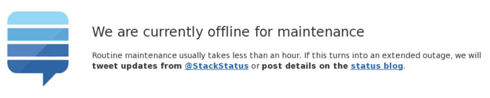

build-lists: true
theme: Terminal

# [fit] You Know Nothing
### or do you?

^
Let us start this with a questions:
Give me a show of hands when the following picture gives you anxiety.

---
[.background-color: #ffffff]



^
Jeah, me too ...

---
[.background-color: #ffffff]


^
Stats (29. December 2018)
- Over 85% of devs visit StackOverflow at least a few times a week (https://insights.stackoverflow.com/survey/2018/#community-visiting-stack-overflow)
- 16,942,114 questions (https://data.stackexchange.com/stackoverflow/query/954525/number-of-questions)
- 2,274,634 questions without a single answer (https://data.stackexchange.com/stackoverflow/query/954533/number-of-questions-without-a-single-answer)
- 26,041,792 answers (https://data.stackexchange.com/stackoverflow/query/954535/number-of-answers)
- 70,616,953 comments (https://data.stackexchange.com/stackoverflow/query/954536/number-of-comments)
- 9,825,838 users (https://data.stackexchange.com/stackoverflow/query/954537/number-of-users)

---
[.background-color: #ffffff]


^
Stats (December 2018) (https://en.wikipedia.org/wiki/Wikipedia:Size_of_Wikipedia)
- 5,772,326 english articles
- 46,731,930 articles (total)
- 35,296,795 users
- 18.64 average revisions per article

---
[.background-color: #ffffff]


^
Stats (November 2018) (https://expandedramblings.com/index.php/github-statistics/)
- 31 million users
- over 100 million repositories

---


^
That's a lot of knowledg

---

```js


function isEven(a) {
  if (a == 0) return true;
  if (a == 2) return true;
  if (a == 4) return true;
  if (a == 6) return true;
  if (a == 8) return true;
  if (a == 10) return true;
  if (a == 12) return true;
  if (a == 14) return true;
  // TODO: Add more checks.
  return false;
}
```

^
Or somebody was trying to be overly clever:

---

```js


function isEven(a) {
  if (a == 0) return true;
  if (a == 1) return false;

  if (a < 0) return isEven(a + 2);
  return isEven(a - 2);
}
```

---
> "Who wrote that code?!"

^
And you furiosly type 'git blame' only to realise ...

---
> "Oh ... me ..."

^
From my experience: every dev has a story like this
And if not: the day will come ...

^
At the same time there are all these topics we have to learn

---


^
So. Much. To. Learn.

---
[.background-color: #ffffff]
[.header: #000000, IBM 3270 Narrow]

# "You're doing
# <br/><br/><br/><br/><br/><br/><br/><br/><br/><br/><br/><br/><br/><br/><br/><br/><br/><br/><br/>
# it wrong!"


^
Seems like a good developer should know all this, right?

---
## What makes a great
# Developer?

---
# A Great Developer

- Awesome tech skills
- Incredible productivity
- High quality code
- Blazing fast learner
- Some Soft skills

---
# __Fear__
## of making
# __mistakes__

^
- Colleagues smarter than me
- Don't want to make a fool out of myself
- Harsh responses from colleagues

---
# __Embarrassment__

^
All boils down to this

---
# *Keep improving*
### so we have something to share

---
# So we __don't__ ...

- answer that StackOverflow question
- do that talk on that meetup
- offer that help to someone
- prepare that workshop
- record that video
- write that blog post
- give input during that meeting

---
# Who could blame us?

---
## We're working in a
# __fast__ moving
## industry

^
Which means, we're pressured to

---
# Perform
# __and__
# Learn

^
Both at the same time; this stresses us out
So we just don't do it. Maybe we write a blog post but never publish it

---
# Sounds familiar?

^
Ask to raise hands?
Welcome to the club

---
[.autoscale: true]

# Hi, I'm Sascha

- Full Stack Developer / TSA
- @grandcentrix in Cologne, Germany
- During my career I:
  + wrote backend services in Java and NodeJS
  + created responsive websites with CSS, Vue, and Elm
  + shaped iOS apps with Objective-C and Swift
  + did some embedded development in C
  + built big backend systems with Elixir
- I know my way around: git, CLI magic, Clean Code, DDD, TDD, and more ...

^
I speak on meetups, now second conference

---
# My Story


[.footer: Photo by Daniel McCullough on Unsplash]
[.footer-style: alignment(right)]

^
Because Buzzkill: This doesn't end!
There is always something you don't know

^
Always absorbed knowledge as I could; I'm good at it

---
# Exhaustion


[.footer: Photo by Tim Gouw on Pexels]
[.footer-style: alignment(right)]

^
But I kept pushing; I put even more on my plate (MCSE certification)

---
# Depression


[.footer: Photo by Sasha Freemind on Unsplash]
[.footer-style: alignment(right)]

^
I came home and slumped on the couch;
My wife repeatedly asked me to go into

---
# Therapy


[.footer: Photo by rawpixel on Unsplash]
[.footer-style: alignment(right)]

^
For over a year now and still working on it
Today I'm here to tell you what I painfully learned (therapist and their pesky questions!)

---
[.header: line-height(0.7), text-scale(1.2), IBM 3270 Narrow]
[.header-emphasis: #2C3850, line-height(0.7), text-scale(1.2), Trim Poster]

# [fit] A New
# [fit] *Frame of Mind*


^
- I didn't suddenly know everything
- I changed my perspective on my work
- In the next few slides I'm gonna try to convey it
- We're gonna make some small detours
- Stick with me it's all gonna come back to Knowledge Sharing

^
LEEEEEROY JEEEENKIIIIIINS!

---
[.background-color: #47B386]
[.footer-style: #FFF186, Trim Poster, alignment(right), line-height(0.8), text-scale(1.0)]
[.text: #2C3850, line-height(1.1), text-scale(1.0), Trim Mono]
[.text-emphasis: #F2EEE7]
[.text-strong: Trim Mono Bold]
[.header: #2C3850, line-height(0.7), text-scale(1.2), Trim Poster]
[.header-emphasis: Trim Poster ExtraCompressed]
[.header-strong: Trim Poster Expanded]
[.link: #FFF186]
[.list: bullet-character(» )]

## We focus a lot on
# Tech Skills

^
It's no wonder: easy to measure; GitHub and Co

---
[.background-color: #47B386]
[.footer-style: #FFF186, Trim Poster, alignment(right), line-height(0.8), text-scale(1.0)]
[.text: #2C3850, line-height(1.1), text-scale(1.0), Trim Mono]
[.text-emphasis: #F2EEE7]
[.text-strong: Trim Mono Bold]
[.header: #2C3850, line-height(0.7), text-scale(1.2), Trim Poster]
[.header-emphasis: Trim Poster ExtraCompressed]
[.header-strong: Trim Poster Expanded]
[.link: #FFF186]
[.list: bullet-character(» )]

# Code Ninja
## &
# Rockstar Dev

^
But what does that actually tells us about a person?

^
See, we look at this tiny part

---
[.background-color: #ffffff]
[.footer-style: #FFF186, Trim Poster, alignment(right), line-height(0.8), text-scale(1.0)]
[.text: #2C3850, line-height(1.1), text-scale(1.0), Trim Mono]
[.text-emphasis: #F2EEE7]
[.text-strong: Trim Mono Bold]
[.header: #2C3850, line-height(0.7), text-scale(1.2), Trim Poster]
[.header-emphasis: Trim Poster ExtraCompressed]
[.header-strong: Trim Poster Expanded]
[.link: #FFF186]
[.list: bullet-character(» )]


[.footer: Photo by Shane Aldendorff from Pexels]

^
Based on that we come to a judgement: "This is a great dev, he really knows his JS!"

---
[.background-color: #ffffff]
[.footer-style: #FFF186, Trim Poster, alignment(right), line-height(0.8), text-scale(1.0)]
[.text: #2C3850, line-height(1.1), text-scale(1.0), Trim Mono]
[.text-emphasis: #F2EEE7]
[.text-strong: Trim Mono Bold]
[.header: #2C3850, line-height(0.7), text-scale(1.2), Trim Poster]
[.header-emphasis: Trim Poster ExtraCompressed]
[.header-strong: Trim Poster Expanded]
[.link: #FFF186]
[.list: bullet-character(» )]


[.footer: Photo by Shane Aldendorff from Pexels]

^
But there is more to a person than just his ability to write JS!

---
[.background-color: #ffffff]
[.footer-style: #FFF186, Trim Poster, alignment(right), line-height(0.8), text-scale(1.0)]
[.text: #2C3850, line-height(1.1), text-scale(1.0), Trim Mono]
[.text-emphasis: #F2EEE7]
[.text-strong: Trim Mono Bold]
[.header: #2C3850, line-height(0.7), text-scale(1.2), Trim Poster]
[.header-emphasis: Trim Poster ExtraCompressed]
[.header-strong: Trim Poster Expanded]
[.link: #FFF186]
[.list: bullet-character(» )]


[.footer: Photo by Markus Spiske from Pexels]

^
And only put together they form a person greater than the sum of their parts

^
What might this parts be?

---
[.background-color: #47B386]
[.footer-style: #FFF186, Trim Poster, alignment(right), line-height(0.8), text-scale(1.0)]
[.text: #2C3850, line-height(1.1), text-scale(1.0), Trim Mono]
[.text-emphasis: #F2EEE7]
[.text-strong: Trim Mono Bold]
[.header: #2C3850, line-height(0.7), text-scale(1.2), Trim Poster]
[.header-emphasis: Trim Poster ExtraCompressed]
[.header-strong: Trim Poster Expanded]
[.link: #FFF186]
[.list: bullet-character(» )]

### Think of somebody you
# respect

^
Can be a colleague, blogger, etc.
Should have something to do with tech

---
[.background-color: #47B386]
[.footer-style: #FFF186, Trim Poster, alignment(right), line-height(0.8), text-scale(1.0)]
[.text: #2C3850, line-height(1.1), text-scale(1.0), Trim Mono]
[.text-emphasis: #F2EEE7]
[.text-strong: Trim Mono Bold]
[.header: #2C3850, line-height(0.7), text-scale(1.2), Trim Poster]
[.header-emphasis: Trim Poster ExtraCompressed]
[.header-strong: Trim Poster Expanded]
[.link: #FFF186]
[.list: bullet-character(» )]

# Which qualities
# do you respect?

---
[.background-color: #47B386]
[.footer-style: #FFF186, Trim Poster, alignment(right), line-height(0.8), text-scale(1.0)]
[.text: #2C3850, line-height(1.1), text-scale(1.0), Trim Mono]
[.text-emphasis: #F2EEE7]
[.text-strong: Trim Mono Bold]
[.header: #2C3850, line-height(0.7), text-scale(1.2), Trim Poster]
[.header-emphasis: Trim Poster ExtraCompressed]
[.header-strong: Trim Poster Expanded]
[.link: #FFF186]
[.list: bullet-character(» )]

## Which qualities do you respect?

- Writes awesome code?
- Great communication skills?
- Empathic and patient?
- Fun to interact with?
- Interested in a variety of topics?
- Prompts you to learn new things?
- Probably lots of other things!

^
The point I'm trying to make, is this:

---
[.background-color: #ffffff]
[.footer-style: #FFF186, Trim Poster, alignment(right), line-height(0.8), text-scale(1.0)]
[.text: #2C3850, line-height(1.1), text-scale(1.0), Trim Mono]
[.text-emphasis: #F2EEE7]
[.text-strong: Trim Mono Bold]
[.header: #2C3850, line-height(0.7), text-scale(1.2), Trim Poster]
[.header-emphasis: Trim Poster ExtraCompressed]
[.header-strong: Trim Poster Expanded]
[.link: #FFF186]
[.list: bullet-character(» )]

### We're more than a walking
# Tech Stack


[.footer: Photo by Eli Francis on Unsplash]

^
First check @GCX: Does this person fit as a person?
??? ADD MORE ???

---
[.background-color: #ffffff]
[.footer-style: #fff186, trim poster, alignment(right), line-height(0.8), text-scale(1.0)]
[.text: #2c3850, line-height(1.1), text-scale(1.0), trim mono]
[.text-emphasis: #f2eee7]
[.text-strong: trim mono bold]
[.header: #2c3850, line-height(0.7), text-scale(1.2), trim poster]
[.header-emphasis: trim poster extracompressed]
[.header-strong: trim poster expanded]
[.link: #fff186]
[.list: bullet-character(» )]


^
- Google had the same realization!
- Teams with super-smart people, they didn't perform
- Why? Research project in 2012, asking a simple question:

---
[.background-color: #47b386]
[.footer-style: #fff186, trim poster, alignment(right), line-height(0.8), text-scale(1.0)]
[.text: #2c3850, line-height(1.1), text-scale(1.0), trim mono]
[.text-emphasis: #f2eee7]
[.text-strong: trim mono bold]
[.header: #2c3850, line-height(0.7), text-scale(1.2), trim poster]
[.header-emphasis: trim poster extracompressed]
[.header-strong: trim poster expanded]
[.quote: #2C3850, line-height(0.7), text-scale(0.9), Trim Mono]
[.quote-author: #FFF186, line-height(0.7), text-scale(1.0), Trim Mono]
[.link: #fff186]
[.list: bullet-character(» )]

> What's the secret to a successful team?
-- Google (Project Aristotle)

^
2 years of research
- 200+ interviews (employees)
- 180+ active teams
- 250 different attributes

^
In the end it boiled down to something called:

---
[.background-color: #47B386]
[.footer-style: #FFF186, Trim Poster, alignment(right), line-height(0.8), text-scale(1.0)]
[.text: #2C3850, line-height(1.1), text-scale(1.0), Trim Mono]
[.text-emphasis: #F2EEE7]
[.text-strong: Trim Mono Bold]
[.header: #2C3850, line-height(0.7), text-scale(1.2), Trim Poster]
[.header-emphasis: Trim Poster ExtraCompressed]
[.header-strong: Trim Poster Expanded]
[.link: #FFF186]
[.list: bullet-character(» )]

# Psychological
# Safety

---
[.background-color: #47B386]
[.footer-style: #FFF186, Trim Poster, alignment(right), line-height(0.8), text-scale(1.0)]
[.footnote: #FFF186, Trim Mono, line-height(0.8), text-scale(0.8)]
[.text: #2C3850, line-height(1.1), text-scale(1.0), Trim Mono]
[.text-emphasis: #F2EEE7]
[.text-strong: Trim Mono Bold]
[.header: #2C3850, line-height(0.7), text-scale(1.2), Trim Poster]
[.header-emphasis: Trim Poster ExtraCompressed]
[.header-strong: Trim Poster Expanded]
[.quote: #2C3850, line-height(1.0), text-scale(1.3), Trim Mono]
[.quote-author: #FFF186, line-height(1.3), text-scale(1.0), Trim Mono]
[.link: #FFF186]
[.list: bullet-character(» )]

# Psychological Safety

> [the] shared belief held by members of a team that the team is safe for interpersonal risk-taking. [...]
> A sense of confidence that the team will not embarrass, reject or punish someone for speaking up.
-- Amy Edmondson (Harvard Business School)[^1]

[^1]: https://www.nytimes.com/2016/02/28/magazine/what-google-learned-from-its-quest-to-build-the-perfect-team.html

^
What does that mean?
- A protected environment to exchange ideas
- Healthy culture around failure
- A lot more things: article from NY Times!

^
Great article from the NYT

^
Not the smartest people build the best teams!
=> Soft Skills matter!

---
[.background-color: #47b386]
[.footer-style: #fff186, Trim Poster, alignment(right), line-height(0.8), text-scale(1.0)]
[.footnote: #FFF186, Trim Mono, line-height(0.8), text-scale(0.8)]
[.text: #2c3850, line-height(1.1), text-scale(1.0), Trim Mono]
[.text-emphasis: #f2eee7]
[.text-strong: Trim Mono Bold]
[.header: #2c3850, line-height(0.7), text-scale(1.2), Trim Poster]
[.header-emphasis: Trim Poster ExtraCompressed]
[.header-strong: Trim Poster Expanded]
[.link: #fff186]
[.list: bullet-character(» )]


^
Pretty much everybody needs them and you need them for pretty much everything

^
Most projects fail due to human reasons

^
So, Core Skills matter but ...

---
[.background-color: #47B386]
[.footer-style: #FFF186, Trim Poster, alignment(right), line-height(0.8), text-scale(1.0)]
[.text: #2C3850, line-height(1.1), text-scale(1.0), Trim Mono]
[.text-emphasis: #F2EEE7]
[.text-strong: Trim Mono Bold]
[.header: #2C3850, line-height(0.7), text-scale(1.2), Trim Poster]
[.header-emphasis: Trim Poster ExtraCompressed]
[.header-strong: Trim Poster Expanded]
[.link: #FFF186]
[.list: bullet-character(» )]

# Why stop here?

^
What other skills might potentially matter?

^
For me:
- RPG/GMing (communicate clearly; group engagement)
- Online Games (more calm etc.)

^
Let me reiterate:

---
[.background-color: #47b386]
[.footer-style: #fff186, trim poster, alignment(right), line-height(0.8), text-scale(1.0)]
[.text: #2c3850, line-height(1.1), text-scale(1.0), trim mono]
[.text-emphasis: #f2eee7]
[.text-strong: trim mono bold]
[.header: #2c3850, line-height(0.7), text-scale(1.2), trim poster]
[.header-emphasis: trim poster extracompressed]
[.header-strong: trim poster expanded]
[.link: #fff186]
[.list: bullet-character(» )]

# Tech enables us

^
but; and that's a darn big but

---
[.background-color: #47b386]
[.footer-style: #fff186, trim poster, alignment(right), line-height(0.8), text-scale(1.0)]
[.text: #2c3850, line-height(1.1), text-scale(1.0), trim mono]
[.text-emphasis: #f2eee7]
[.text-strong: trim mono bold]
[.header: #2c3850, line-height(0.7), text-scale(1.2), trim poster]
[.header-emphasis: trim poster extracompressed]
[.header-strong: trim poster expanded]
[.link: #fff186]
[.list: bullet-character(» )]

# Tech does
# __not__
# define us

^
You definitely need some tech skills to work in this industry but they don't make you necessarily a great dev

^
=> Let's revisit a question from earlier

---
[.background-color: #47B386]
[.footer-style: #FFF186, Trim Poster, alignment(right), line-height(0.8), text-scale(1.0)]
[.text: #2C3850, line-height(1.1), text-scale(1.0), Trim Mono]
[.text-emphasis: #F2EEE7]
[.text-strong: Trim Mono Bold]
[.header: #2C3850, line-height(0.7), text-scale(1.2), Trim Poster]
[.header-emphasis: Trim Poster ExtraCompressed]
[.header-strong: Trim Poster Expanded]
[.link: #FFF186]
[.list: bullet-character(» )]

## What makes a great
# Developer?

^
But this time ...

---
[.background-color: #47B386]
[.footer-style: #FFF186, Trim Poster, alignment(right), line-height(0.8), text-scale(1.0)]
[.text: #2C3850, line-height(1.1), text-scale(1.0), Trim Mono]
[.text-emphasis: #F2EEE7]
[.text-strong: Trim Mono Bold]
[.header: #2C3850, line-height(0.7), text-scale(1.2), Trim Poster]
[.header-emphasis: Trim Poster ExtraCompressed]
[.header-strong: Trim Poster Expanded]
[.link: #FFF186]
[.list: bullet-character(» )]

# A Great Developer
### might ...

- have solid tech skills
- work great in a team
- communicate clearly and concisely
- remain calm under pressure
- be somebody you can always rely on
- have other qualities I can't think of!

^
- team = sports (e- or real)
- communicate = rpgs, theater
- calm = dancer, "blitzschach"
- rely = raids in WoW

---
[.background-color: #ffffff]
[.footer-style: #fff186, Trim Poster, alignment(right), line-height(0.8), text-scale(1.0)]
[.text: #2c3850, line-height(1.1), text-scale(1.0), Trim Mono]
[.text-emphasis: #f2eee7]
[.text-strong: Trim Mono bold]
[.header: #2c3850, line-height(0.7), text-scale(1.2), Trim Poster]
[.header-emphasis: Trim Poster ExtraCompressed]
[.header-strong: Trim Poster Expanded]
[.link: #fff186]
[.list: bullet-character(» )]


[.footer: Photo by Arnold Dogelis on Unsplash]

^
Ofc you can build a house on stilts but it will always be more stable when you build it on the ground!

^
Recognize = All your skills are potentially important!
=> When you share, and it's wrong, it's not so bad!

---
[.background-color: #ffffff]
[.footer-style: #fff186, Trim Poster, alignment(right), line-height(0.8), text-scale(1.0)]
[.footnote: #FFF186, Trim Mono, line-height(0.8), text-scale(0.8)]
[.text: #2c3850, line-height(1.1), text-scale(1.0), Trim Mono]
[.text-emphasis: #f2eee7]
[.text-strong: Trim Mono bold]
[.header: #2c3850, line-height(0.7), text-scale(1.2), Trim Poster]
[.header-emphasis: Trim Poster ExtraCompressed]
[.header-strong: Trim Poster Expanded]
[.link: #fff186]
[.list: bullet-character(» )]


# Wholesome
# Person

[.footer: ]

---
[.background-color: #ffffff]
[.footer-style: #fff186, trim poster, alignment(right), line-height(0.8), text-scale(1.0)]
[.text: #2c3850, line-height(1.1), text-scale(1.0), trim mono]
[.text-emphasis: #f2eee7]
[.text-strong: trim mono bold]
[.header: #2c3850, line-height(0.7), text-scale(1.2), trim poster]
[.header-emphasis: trim poster extracompressed]
[.header-strong: trim poster expanded]
[.link: #fff186]
[.list: bullet-character(» )]

# Tips
## &
# Tricks


[.footer: Photo by Guy Kawasaki on Pexels]

^
These helped ME; maybe they'll help you

---
[.background-color: #ffffff]
[.background-color: #47B386]
[.footer-style: #FFF186, Trim Poster, alignment(right), line-height(0.8), text-scale(1.0)]
[.text: #2C3850, line-height(1.1), text-scale(1.0), Trim Mono]
[.text-emphasis: #F2EEE7]
[.text-strong: Trim Mono Bold]
[.header: #2C3850, line-height(0.7), text-scale(1.2), Trim Poster]
[.header-emphasis: Trim Poster ExtraCompressed]
[.header-strong: Trim Poster Expanded]
[.link: #FFF186]
[.list: bullet-character(» )]

## Document the
# __Journey__
## not the
# __Goal__


[.footer: Photo by Sharefaith from Pexels]

^
- Mistakes & Pitfalls
- Questions you had and their answers
- Reference for you

---
[.background-color: #47B386]
[.footer-style: #FFF186, Trim Poster, alignment(right), line-height(0.8), text-scale(1.0)]
[.text: #2C3850, line-height(1.1), text-scale(1.0), Trim Mono]
[.text-emphasis: #F2EEE7]
[.text-strong: Trim Mono Bold]
[.header: #2C3850, line-height(0.7), text-scale(1.2), Trim Poster]
[.header-emphasis: Trim Poster ExtraCompressed]
[.header-strong: Trim Poster Expanded]
[.link: #FFF186]
[.list: bullet-character(» )]

# ~Ask colleagues where they think you know your stuff~

---
[.background-color: #47B386]
[.footer-style: #FFF186, Trim Poster, alignment(right), line-height(0.8), text-scale(1.0)]
[.text: #2C3850, line-height(1.1), text-scale(1.0), Trim Mono]
[.text-emphasis: #F2EEE7]
[.text-strong: Trim Mono Bold]
[.header: #2C3850, line-height(0.7), text-scale(1.2), Trim Poster]
[.header-emphasis: Trim Poster ExtraCompressed]
[.header-strong: Trim Poster Expanded]
[.link: #FFF186]
[.list: bullet-character(» )]

## Start a
# __TIL__
## List

^
And do not focus on tech only!

---
[.background-color: #47B386]
[.footer-style: #FFF186, Trim Poster, alignment(right), line-height(0.8), text-scale(1.0)]
[.text: #2C3850, line-height(1.1), text-scale(1.0), Trim Mono]
[.text-emphasis: #F2EEE7]
[.text-strong: Trim Mono Bold]
[.header: #2C3850, line-height(0.7), text-scale(1.2), Trim Poster]
[.header-emphasis: Trim Poster ExtraCompressed]
[.header-strong: Trim Poster Expanded]
[.link: #FFF186]
[.list: bullet-character(» )]

# ~I did the best I could with the knowledge I had~

^
Code is distilled knowledge; writing it is a learning process

---
[.background-color: #47B386]
[.footer-style: #FFF186, Trim Poster, alignment(right), line-height(0.8), text-scale(1.0)]
[.text: #2C3850, line-height(1.1), text-scale(1.0), Trim Mono]
[.text-emphasis: #F2EEE7]
[.text-strong: Trim Mono Bold]
[.header: #2C3850, line-height(0.7), text-scale(1.2), Trim Poster]
[.header-emphasis: Trim Poster ExtraCompressed]
[.header-strong: Trim Poster Expanded]
[.link: #FFF186]
[.list: bullet-character(» )]

## Focus on the
# __Learnings__
## not the
# __Mistakes__

^
Not “I can’t make mistakes” but “I learned X for the future!”

---
[.background-color: #47B386]
[.footer-style: #FFF186, Trim Poster, alignment(right), line-height(0.8), text-scale(1.0)]
[.text: #2C3850, line-height(1.1), text-scale(1.0), Trim Mono]
[.text-emphasis: #F2EEE7]
[.text-strong: Trim Mono Bold]
[.header: #2C3850, line-height(0.7), text-scale(1.2), Trim Poster]
[.header-emphasis: Trim Poster ExtraCompressed]
[.header-strong: Trim Poster Expanded]
[.link: #FFF186]
[.list: bullet-character(» )]
[.autoscale: true]

# Hi again, I'm still Sascha

- Husband / Father / Roleplayer / Developer
- Gamemaster for two groups, player in one
- Atheist, very interested in theology
- Big on bringing compassion into work and life
- Techy, full stack dev with a love for FP
- Read a lot: SciFi, RPGs, thought-provoking stuff
- Interests: game design & gaming, mindfulness, philosophy, ethics, space, productivity