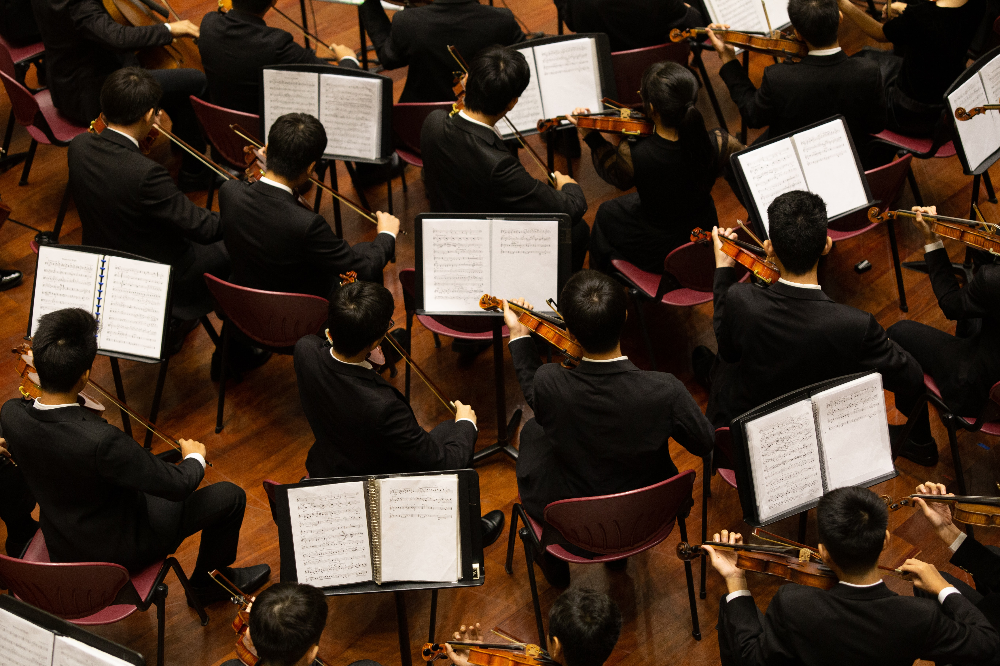

footer-style: #fff, alignment(left)
build-lists: true
slide-transition: true
theme: Fira, 5

---
[.footer: Photo by Samuel Sianipar]

> No one can whistle a symphony. It takes a whole orchestra to play it.
-- H.E. Luccock

^
a rather unknown Methodist Bishop

---

# __Collaboration__

^
Uniquely Human

---
[.footer: Photo by Mitchell Luo]

---

# Shared
# __Goal__

---
[.slide-transition: false]

# Shared
# __Language__

^
Body, Words

^
Word: Container

---
[.slide-transition: false]

# Shared
# __Context__

^
Culture

---
[.footer: Photo by Daniel Klein]

---

---

- Shared Goal
- Shared Language
- Shared Context

^
Beautiful together

---

---
