theme: Scherzkeks, 7

# Layers
## of an
# *Onion*

---

^
This is Alex

---

^
Alex has a great idea for an app

---

^
Needs app

---

^
Needs browser functionality

---

^
Needs message sending

---

^
Needs to save stuff in DB

---

^
First prototype no problem!

^
- Some in API controllers
- Some in message sending
- Some in browser rendering

^
- Some messages as push?
- More features in browser? Reuse API?
- External service wants to trigger things!

---

^
AAAAAAAAAAAAAAH

^
How to manage all these different systems and keep my business logic clean?!

---
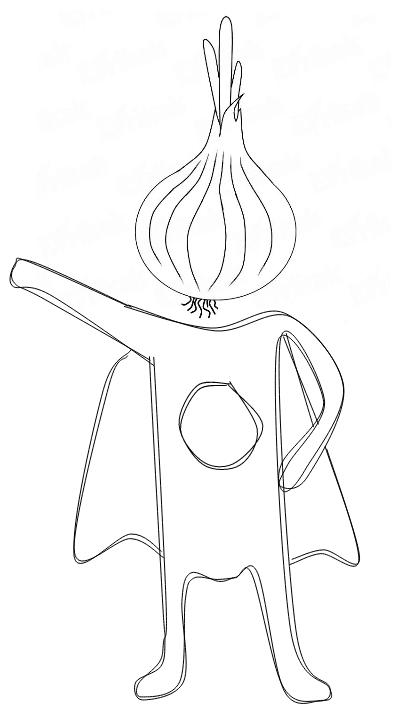

^
CAPTIAN ONION TO THE RESCUE

---

^
Can you help me?

---
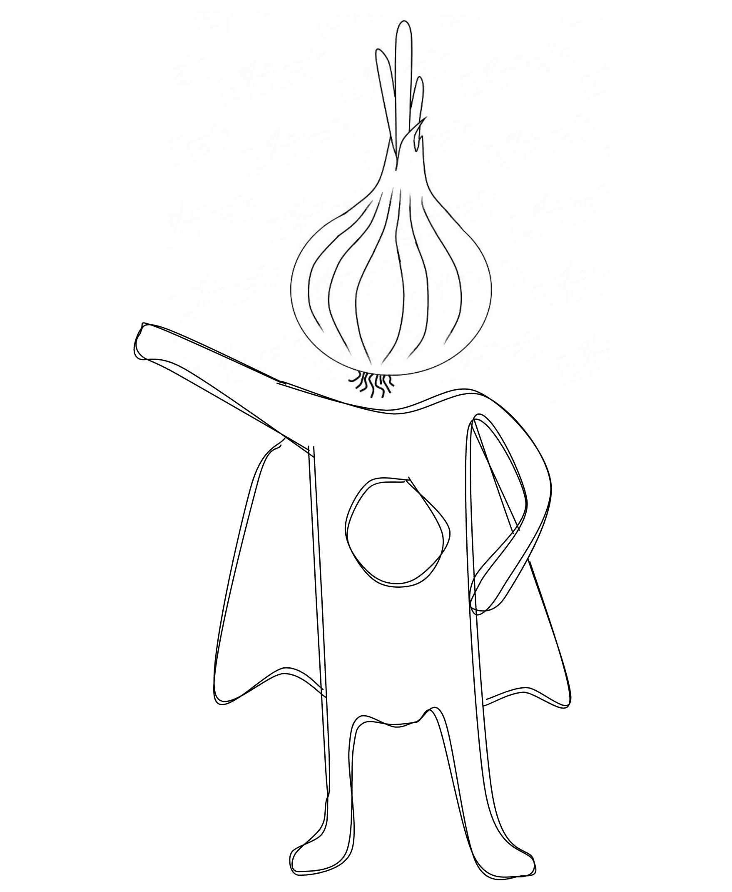

^
Sure!

---

^
BUT HOW?!

---

^
CHANNEL

---
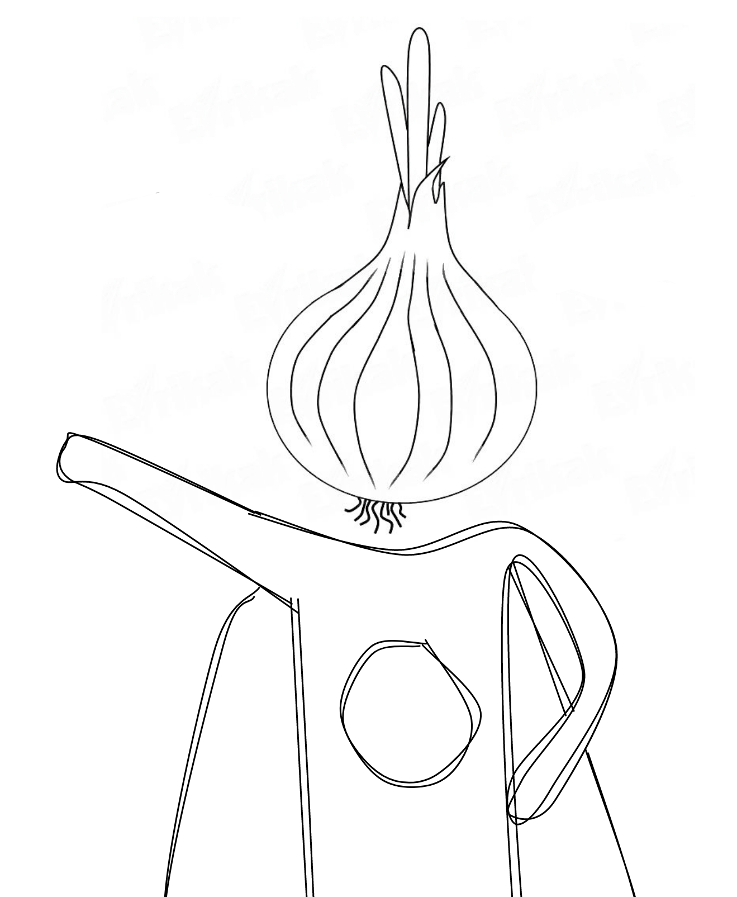

^
THE

---
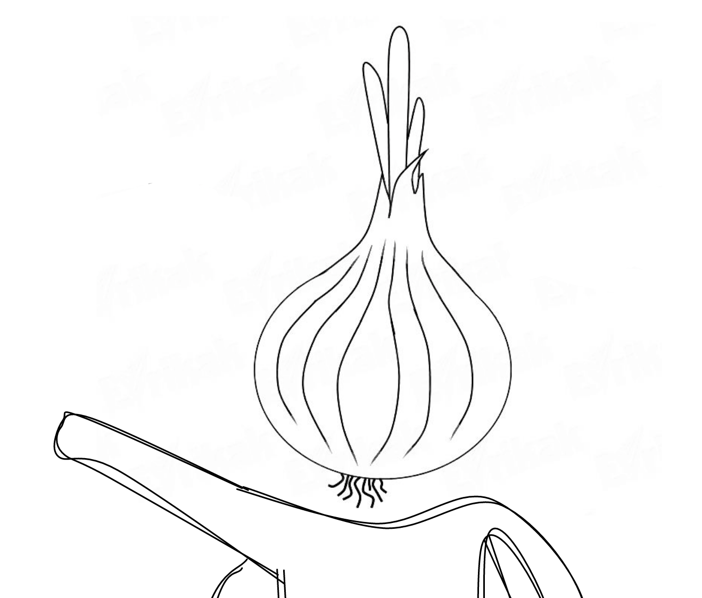

^
ONION

---
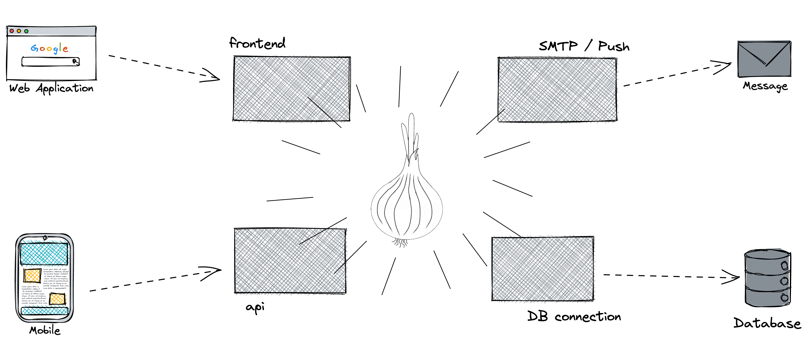

^
*Fart noise*

^
Problem solved!

---
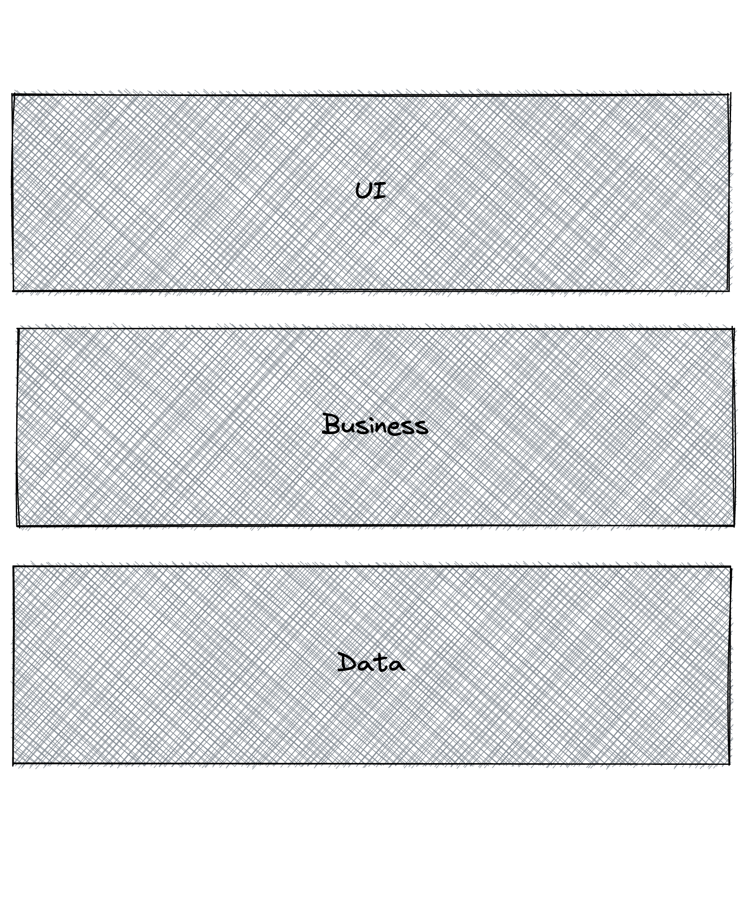

---
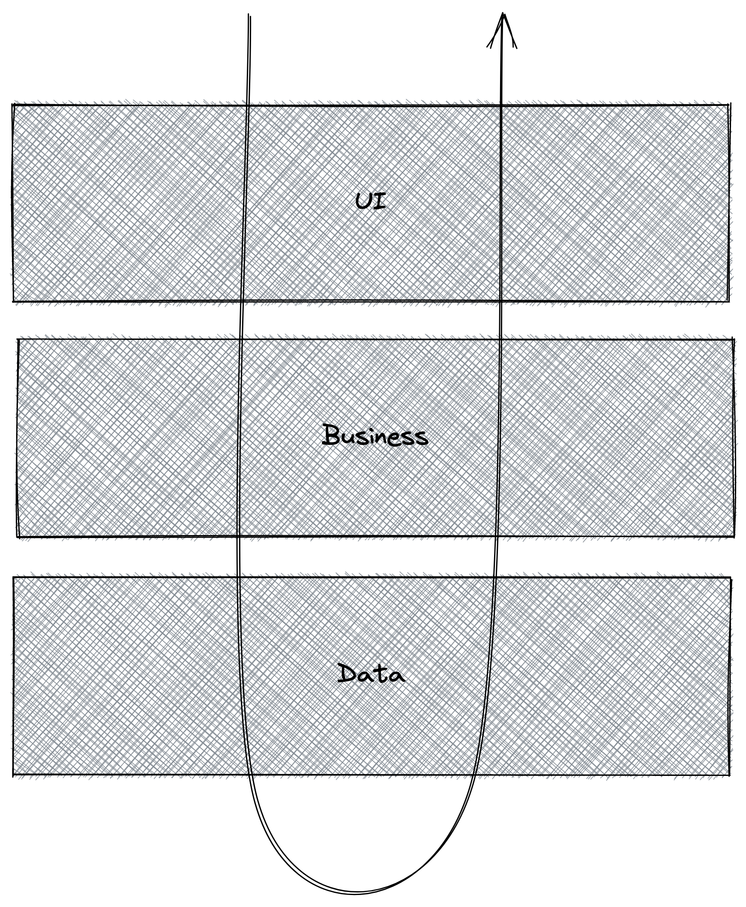

^
Too simple view on the world

^
As seen earlier, what about side-effects like emails, push notifications etc. where that?

^
Business depends on data does that sound right?

---

---

---

---

---

---

---

---
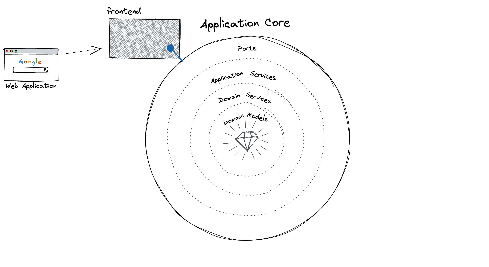

---
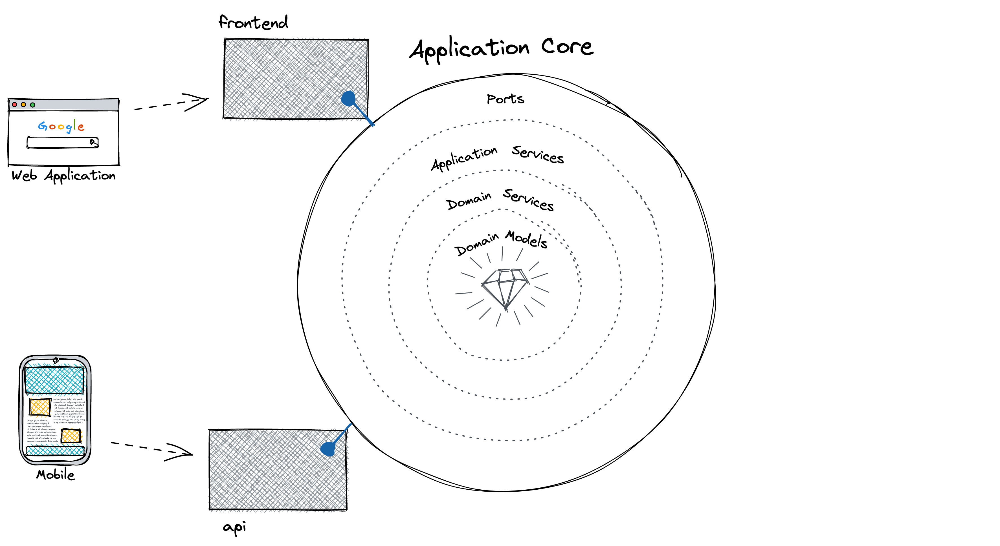

---
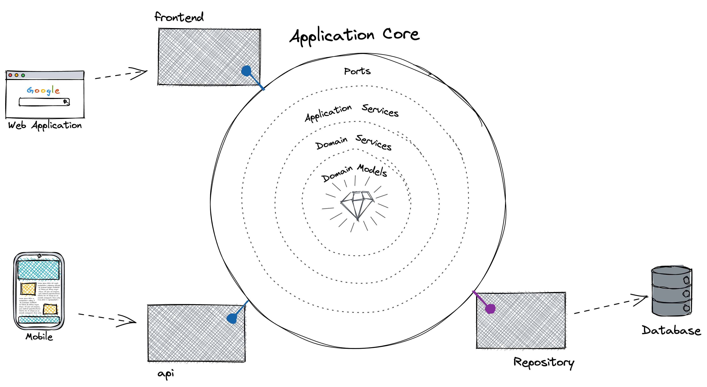

---
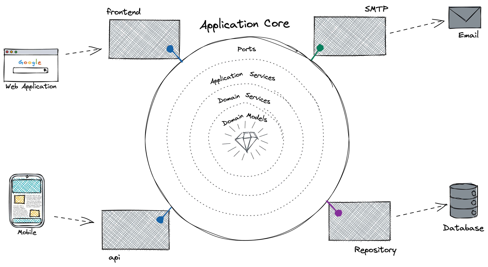

---
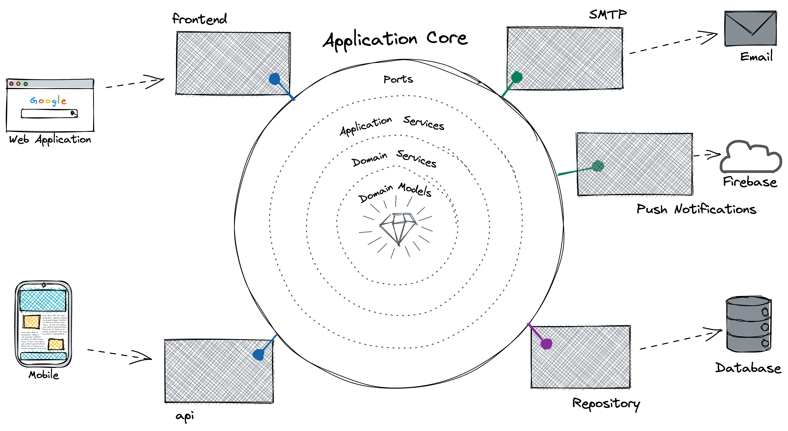

---
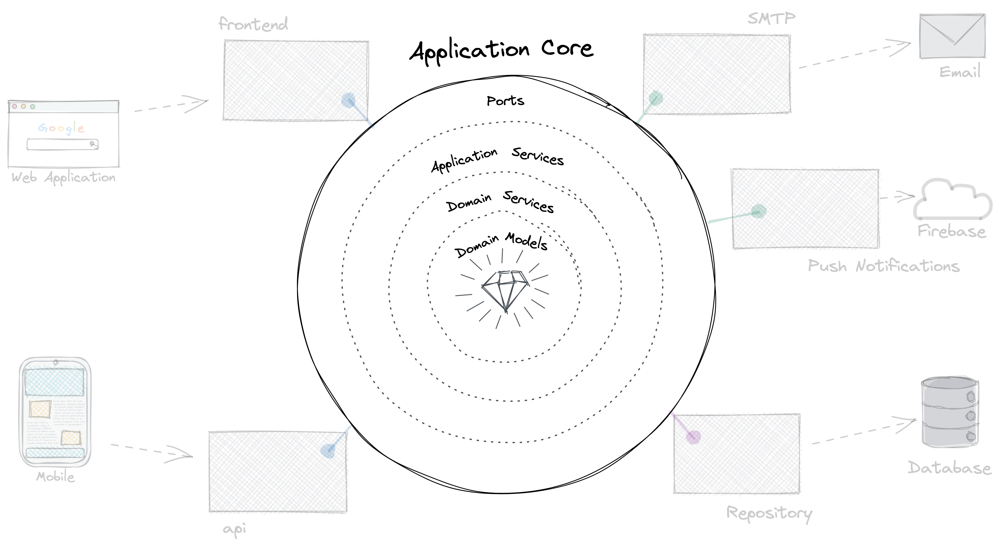

---

