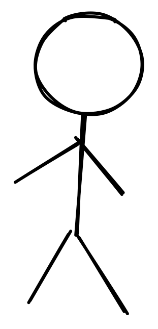
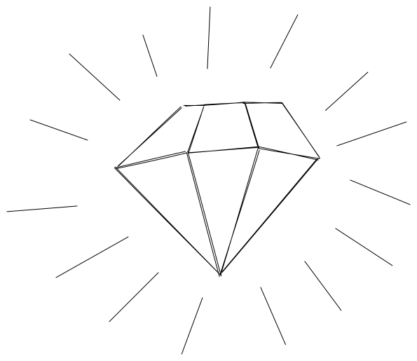
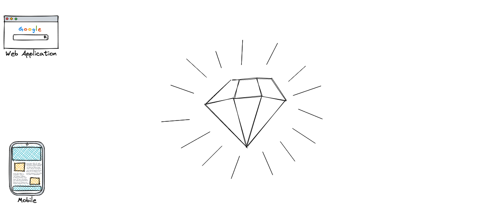
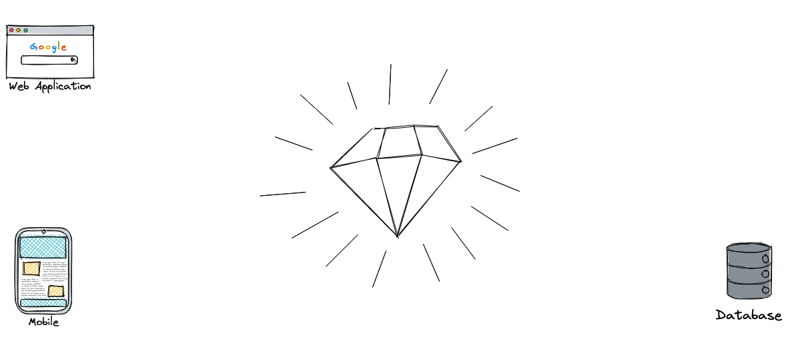
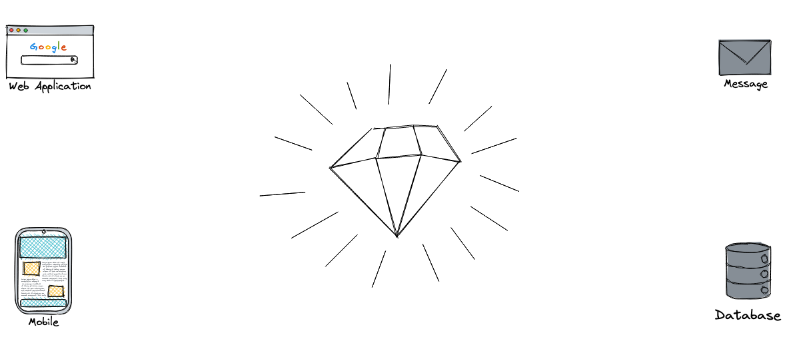
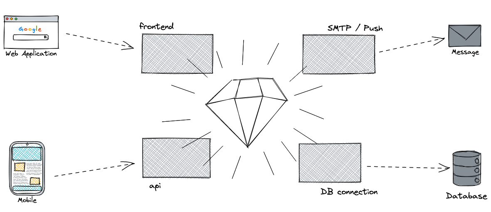
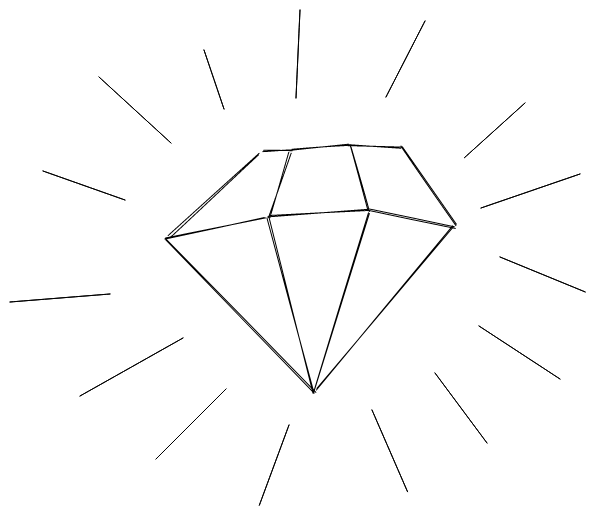
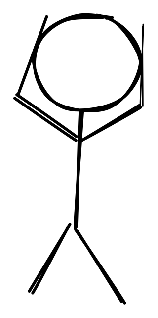

theme: Scherzkeks, 7

# Layers
## of an
# *Onion*

---

---

---

---

---

---

---

---

---

---
[.autoscale: true]

# Hero's Journey

1. The journey begins with the introduction of the Heroes in the Ordinary World, where
2. they are presented with the Call to Adventure.
3. Their initial reluctance may lead to Refusal of the Call, but they
4. receive encouragement from a Mentor to
5. cross over the Threshold and gain entry into the Special World.
6. There, they encounter Tests, Allies, and Enemies.
7. They Approach the Inmost Cave where
8. they must endure an Ordeal.
9. The Reward is seized and
10. they are pursued as they follow The Road Back to the Ordinary World.
11. They are transformed by the experience of a Resurrection and
12. return triumphant with the Elixir—an item of great value that will benefit the Ordinary World.

---

## Inline Images

When using the **[inline]** modifier, images automatically centre and fit to the available space.

---

Use **[inline, left]** or **[inline, right]** to move images around. With the text underneath like this, it is the simplest ways to add captions to images.

---

# Tables

With `:---:`, `---:` and `:---` you can center, right or right align the cell content.

  Header 1 |    Header 2   |   Header 3   |
-----------| :-----------: | -----------: |
Cell       |     _Cell_    |     *Cell*
Cell       |   **Cell**    |     __Cell__