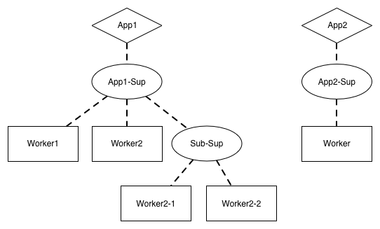

theme: Poster (Quote)
build-lists: true
footer: _`Sascha Wolf | 🐦 wolf4earth | saschawolf.me`_

[.background-color: #1F233D]
[.header-strong: #1F223D]

## **il**A**i**_Sip_**lll.**
## of **_Elixir_**

---


---
## What is *Elixir*?

---
# What is *Elixir*?

<br/>
> Elixir is a dynamic, functional language designed for building scalable and maintainable applications.
-- elixir-lang.org

^
Great sales pitch, right?

---
### To understand
## _Elixir_[^1]
### we need to understand its
## _History_

[^1]: and the problems it tries to solve

---
## The year is
# _2012_

---
# José _Valim_

^
Well-known Rubyist

---
# José _Valim_


` `

---
# José _Valim_


__A well-known Rubyist__

- _Rails_ 44.2k ⭐ (Contributor)
- _Devise_ 20.2k ⭐
- _Simple Form_ 7.5k ⭐
- And more ...

^
He became frustrated with Rubys approach to ...

---
# _Concurrency_

^
Why? CPUs don't get much faster, instead multiple CPUs

---


^
Compared different concurreny models

---
# _Erlang_

^
Running in ...

---
# _BEAM_
#### _Erlang_ VM

^
Concurrency: Using the ...

---
# _Actor_ Model[^2]

[^2]: `Technically almost-actor (https://www.youtube.com/watch?v=_0m0_qtfzLs)`

^
Q: Familiarity

^
Why almost? According to Dr. Carl Hewitt (inventor of the actor model in 1973)
Why? Because Erlang was designed without it's knowledge

---
[.background-color: #ffffff]
[.footer-style: #000000]
[.footer: `source: https://www.brianstorti.com/the-actor-model/`]


^
- Actor = fundamental unit of computation
- Isolation (shared nothing) - immutable data
- Message passing
- Sequential processing

^
When message arrives (one of):
- Create more actors
- Send messages to other actors
- Designate what to do with the next message = Mutate State

---
## _Erlang_ was created
## at _Ericsson_ for
## _telephony switches_

---
- Distributed
- Fault-tolerant
- Soft real-time
- High-availability

^
- Light processes
- Hot-code reloading
- self-recovering

---
## Work on
## _Erlang_ started
## in _1987_

---
## It went
## _open-source_
## in _1998_

---
## _Battle-tested_
## in over _30 years_
## of _usage_

^
Sounds pretty good, right?

^
BUT ...

---
```erlang
-module(greetings).
-export([hello/1]).

hello(Name) ->
    io:format("Hello ~s~n", [Name]).
```

^
Syntax: Prolog-inspired
Not a bad language, but takes some getting used to
Old language which you notice

---
## ` `Ruby `       ` _Erlang_


^
Ruby = Developer productivity and happiness

^
Erlang = Powerful and battle-hardened concurrency

---


^
Remember, Erlang runs in a VM

---
# _BEAM_

^
A VM; just like the JVM

---
```erlang
-module(greetings).
-export([hello/1]).

hello(Name) ->
    io:format("Hello ~s~n", [Name]).
```


---
```elixir
defmodule Greetings do
  def hello(name) do
    IO.puts("Hello #{name}")
  end
end
```

^
`#{name}` = string interpolation

---
### _Ruby_
#### +
### _Erlang_
#### =
## **_Elixir_**

^
With the history out of the way, let's talk specifics

^
First: Whirlwind tour of syntax

---
# _Syntax_ Crashcurse

---
[.autoscale: true]
[.list: alignment(left)]

# _Syntax_ Crashcurse - Basic Types

- _List:_ `[3, 1, 4, 1, 5]`
- _Map:_ `%{key: "value"}`
- _Atom:_ `:an_atom`
- _Boolean:_ `true || false`
- _Tuple:_ `{"have some PI", 3.1415, :the_pi_is_a_lie}`
- _Function:_ `fn x, y -> x * y end`

^
Excluded the "obvious" stuff: numbers, strings, etc.

^
Atoms: Constants, some languages call them symbols (like Ruby) - booleans are atoms
Useful for pattern matching

^
Functions = Anonymous functions

---
[.autoscale: true]
[.list: alignment(left)]

# _Syntax_ Crashcurse - Operators

- _Basics:_ `+, -, *, /, ==, <, >, &&, ||`
- _String Concatination:_ `"Hello" <> " Lambda Cologne"`
- _List Concatination:_ `[3, 1, 4] ++ [1, 5]`
- _Pipe:_ `[3, 1, 4, 1, 5] |> Enum.map(fn x -> x * 2 end) |> Enum.sum()`

---
# _Syntax_ Crashcurse - Pipe
<br/>

[.code-highlight: 1-2]
[.code-highlight: 4-5]
```elixir
iex> [3, 1, 4, 1, 5] |> Enum.map(fn x -> x * 2 end) |> Enum.sum()
28

iex> Enum.sum(Enum.map([3, 1, 4, 1, 5], fn x -> x * 2 end))
28
```

^
Remember? Immutable data! That's why pipe is so useful

^
Alternative: variables, variables, variables (which is what you see in Erlang)

---
# **_Elixir_**

- developer happiness
- pattern-matching
- syntactic macro system
- Erlang goodness

---
# _Developer_ Happiness

---
## _Great_ Tooling

- build tool `mix`
- code formatter
- unit testing framework
- first-class documentation
- and more ...

^
All maintained by the core team

^
Not gonna talk about `mix` and formatter

---
## Unit Testing Framework
### _`ExUnit`_

---
[.code-highlight: all]
[.code-highlight: 6]
```elixir
defmodule GreetingsTest do
  use ExUnit.Case, async: true

  test "it greets friendly" do
    assert Greetings.hello("Lambda Cologne") ==
             "Hello Lambda Cologne!"
  end
end
```

^
`async: true` because code is pure

^
*Highlight change with laser: "!" at the end*

^
Test failure looks like this:

---
[.background-color: #191918]


^
Tells us about the code, the left value, the right value etc.

^
"Knows" we used `==`: How?
Syntactic Macro System - `assert` is a macro

---
## First-Class _Documentation_

^
Okay, what does that mean?

---
[.hide-footer]


^
Elixir takes good docs seriously

---
```elixir
defmodule Greetings do
  @doc """
  Prints a friendly greeting.

  ## Examples

      iex> Greetings.hello("Lambda Cologne")
      "Hello Lambda Cologne!"
  """
  def hello(name) do
    IO.puts("Hello #{name}")
  end
end
```

^
First: docs are **not** comments

^
`@doc` is a **module attribute**; basically a module-level constant

---
[.background-color: #191918]


^
Neat but not **that** impressive

---
[.hide-footer]


---
```elixir
defmodule GreetingsTest do
  use ExUnit.Case, async: true

  doctest Greetings
end
```

---
[.background-color: #191918]


---
# And _more_ ...

- Powerful interactive console (`iex`)
- "Batteries included" web framework (Phoenix)
- A bunch more neat Erlang/OTP things:
- Supervision trees, observer, remote debugging, hot code upgrades ...

^
iex: Auto-complete, great data inspection, docs, command history etc.

^
Phoenix: We're gonna hear a bit more about this from Peter, I think

---
# _Pattern_
# Matching

^
Q: Who here is familiar with pattern matching? (FP-ler should?)

^
Similar: Destructuring?

^
Example: List

---
```elixir
iex> my_list = [3, 1, 4, 1, 5, 9, 2, 6, 5]
iex> [first, second | rest] = my_list
iex> first
3
iex> second
1
iex> rest
[4, 1, 5, 9, 2, 6, 5]
```

^
Example: Map (or Dict/Hash)

---
```elixir
iex> my_map = %{a: 1, b: 2, c: 3}
iex> %{a: a, b: b} = my_map
iex> a
1
iex> b
2
```

^
Example: Strings

---
```elixir
iex> greeting = "Hello Lambda Cologne"
iex> "Hello " <> name = greeting
iex> name
"Lambda Cologne"
```

^
Usually you think of `=` as the "Assignment Operator"

---
# _`=`_
#### is the
## ~~_Assignment_ Operator~~
## _Match_ Operator

^
Match left side against right side

^
What happens when it can't match?

---
```elixir
iex> "Hello " <> name = "Salut Lambda Cologne"
** (MatchError) no match of right hand side value: "Salut Lambda Cologne"
    (stdlib) erl_eval.erl:453: :erl_eval.expr/5
    (iex) lib/iex/evaluator.ex:257: IEx.Evaluator.handle_eval/5
    (iex) lib/iex/evaluator.ex:237: IEx.Evaluator.do_eval/3
    (iex) lib/iex/evaluator.ex:215: IEx.Evaluator.eval/3
    (iex) lib/iex/evaluator.ex:103: IEx.Evaluator.loop/1
    (iex) lib/iex/evaluator.ex:27: IEx.Evaluator.init/4
```

---
## _Pattern_ Matching
## is everywhere

---
```elixir
defmodule Greetings do
  def hello("") do
    hello("anonymous")
  end

  def hello("Lambda " <> city) do
    hello("FP-Enthusiast from #{city}")
  end

  def hello(name) do
    "Hello #{name}!"
  end
end
```

^
Clauses are "tried" in order of declaration

^
Pretty common pattern (not the stupid greetings):
Multiple clauses matching and calling each other

^
I could talk more about pattern matching but we have limited time ...

---
# _Syntactic_
# Macros

^
Depending on time ...
Q: Macros or high-level patterns?

^
Q: Who knows what that is?
Q2: Who knows what macros are?

---

### Transform the
# _AST_
#### _A_bstract _S_yntax _T_ree

^
C-Macros: Fancy string replacement

^
Languages: Lisp (most well-known), Rust, Elixir, and more
Lisp: Basically write the AST directly

^
Why is that cool?

---
### Use the
##_full power_
### of
## **_Elixir_**

^
Let's have an example ...

---
```elixir
defmodule Conditional do
  defmacro if(condition, do: true_block, else: false_block) do
    quote do
      case unquote(condition) do
        true -> unquote(true_block)
        false -> unquote(false_block)
      end
    end
  end
end
```

^
`quote` and `unquote` = string + interpolation for code (AST)

---
```elixir
iex> import Conditional
iex> if true do
...>   "dis is true"
...> else
...>   "dis is false"
...> end
"dis is true"
```

^
Elixir has an `if` and it's a macro

---
```
application/andrew-inset      ez
application/applixware        aw
application/atom+xml        atom
application/atomcat+xml       atomcat
application/atomsvc+xml       atomsvc
application/ccxml+xml       ccxml
application/cdmi-capability     cdmia
application/cdmi-container      cdmic
application/cdmi-domain       cdmid
application/cdmi-object       cdmio
application/cdmi-queue        cdmiq
application/cu-seeme        cu
```

^
Left: Mime Type | Right: Extension

---
```elixir
defmodule MimeType do
  "path/to/mime-types.txt"
  |> File.read!()
  |> Enum.map(fn line ->
    [mime_type, extension] = String.split(line, " ", trim: true)

    def to_extension(unquote(mime_type)), do: unquote(extension)
  end)
end
```

---
```elixir
iex> MimeType.to_extension("application/applixware")
"aw"
```

---
## **_Elixir_** Macros
## are _hygenic_

^
Hygenic: Variables declared in Macros don't pollute the caller context

^
Example: x in caller, x in macro, doesn't override

---
# _Erlang_ goodness

^
What does that mean?

---
```erlang
-module(greetings).
-export([hello/1]).

hello(Name) ->
    io:format("Hello ~s~n", [Name]).
```

---
```elixir
defmodule Greetings do
  def hello(name) do
    :greetings.hello(name)
  end
end
```

^
A lot of Elixirs std just delegates to Erlang
Example: Enum.reverse

^
Not unlike the state of languages on the JVM

---
# _OTP_
#### _O_pen _T_elecom _P_latform

---
# _O_pen _T_elecom _P_latform

> If half of Erlang's greatness comes from its concurrency and distribution and the other half comes from its error handling capabilities, then the OTP framework is the third half of it.
-- Learn You Some Erlang for Great Good! (Frederic Trottier-Hebert)[^3]

[^3]: https://learnyousomeerlang.com/what-is-otp

^
At the core of most Elixir applications
Because: the basic building block is a

---
# _Process_
#### Actor

^
OTP provides a framework on how to structure your processes

^
Example:

---
# _Database_ Connection

^
What would be tasks?

---
# _Database_ Connection
<br/>

- establish a connection
- do some work*
- disconnect

---
[.build-lists: false]

# _Database_ Connection
<br/>

- establish a connection
- run a query*
- disconnect
<br/>

<sup>* Usually you would have some kind of checkout/checkin mechanism</sup>

^
INIT: establish a connection
SYNC: run a query*
ASYNC: disconnect

^
OTP Abstraction:

---
# _Gen_Server

---
[.code-highlight: all]
[.code-highlight: 2]
[.code-highlight: 4-8]
[.code-highlight: 10-14]
[.code-highlight: 16-20]
```elixir
defmodule DbConnection do
  use GenServer

  def init(uri) do
    connection = MyDatabase.establish_connection(uri)

    {:ok, connection}
  end

  def handle_call({:query, query}, _from, connection) do
    result = MyDatabase.run_query(connection, query)

    {:reply, result, connection}
  end

  def handle_cast(:disconnect, connection) do
    connection = MyDatabase.close_connection(connection)

    {:stop, :normal, connection}
  end
end
```

^
`use GenServer`: "use" is a macro, injects some boilerplate

^
`init`, `handle_cast`, and `handle_call` are callbacks from the GenServer "behaviour" (interfaces)

---
```elixir
iex> {:ok, pid} = GenServer.start_link(DbConnection, "my-database-uri")

iex> query = "SELECT * FROM users"
iex> GenServer.call(pid, {:query, query})
[ ... ] # List of users

iex> GenServer.cast(pid, :disconnect)
:ok
```

^
Quite boilerplaty, that’s why you often see this ...

---
```elixir
defmodule DbConnection do
  use GenServer

  def start_link(uri) do
    GenServer.start_link(DbConnection, uri)
  end

  def query(pid, query) do
    GenServer.call(pid, {:query, query})
  end

  def disconnect(pid) do
    GenServer.cast(pid, :disconnect)
  end

  # init, handle_call, handle_cast
end
```

---
## What if the
# _Database_
## goes down?

---
# 💥

---
> Let it crash
-- Old _Erlang_ wisdom

^
"Let it crash" refers to processes, ofc don't crash them willi-nilli

---
# _**Let it crash**_

<br/>
> 131 out of 132 bugs are transient bugs
-- Erlang in Anger (which refers here to Jim Gray)[^4]

[^4]: https://www.erlang-in-anger.com

^
__Full quote:__
131 out of 132 bugs are transient bugs (they're non-deterministic and go away when you look at them, and trying again may solve the problem entirely), according to Jim Gray in "Why Do Computers Stop and What Can Be Done About It?"

---
# _Examples_ of transient bugs

- Network request fails
- File IO has a hickup
- Odd race condition
- Weird datetime issue
- Database goes down

^
And so on and so forth

^
Myriad reasons why things can break

---
> Let it crash
-- Old _Erlang_ wisdom

^
Can't possibly protect against everything

^
Handle **expected** issues

^
Ofc you don't want your system to go down: OTP

---
# _Supervisors_

---
# _Supervisors_

> The supervisor is responsible for starting, stopping, and monitoring its child processes. The basic idea of a supervisor is that it must keep its child processes alive by restarting them when necessary.
-- Erlang Documentation[^5]

[^5]: http://erlang.org/doc/man/supervisor.html#supervision-principles

^
Child Process: Worker or another Supervisor

---
[.background-color: #fff]
[.hide-footer]



^
Strategies: :one_for_one, :one_for_all, :rest_for_one

---
```elixir
defmodule MyApp.Application do
  # See https://hexdocs.pm/elixir/Application.html
  # for more information on OTP Applications
  use Application

  def start(_type, _args) do
    # List all child processes to be supervised
    children = [
      MyApp.Repo,
      MyApp.Endpoint
    ]

    # See https://hexdocs.pm/elixir/Supervisor.html
    # for other strategies and supported options
    opts = [strategy: :one_for_one, name: MyApp.Supervisor]
    Supervisor.start_link(children, opts)
  end
end
```

---
# Standing on the _shoulders_ of _Giants_

- _`Agent`_ - keep and manipulate state
- _`Task`_ - easy asynchronous processing
- _`GenStage`_ - exchange events with back-pressure between producer and consumer processes

---
# There's _more_ ...

- remote debugging
- built-in support for node clustering
- hot code upgrades (upgrade while running)
- great support for metrics and introspection
- ...

---
# _Summary_

---
# **_Elixir_**

- functional and dynamically typed
- focusses on developer happiness
- considers documentation a first-class citizen
- provides a full syntactic macro system
- stands on the shoulders of giants (_Erlang_/_OTP_)

^
Erlang/OTP: easily build resilient systems

---
## _Thank you_
## for listening

---
# _Questions_?