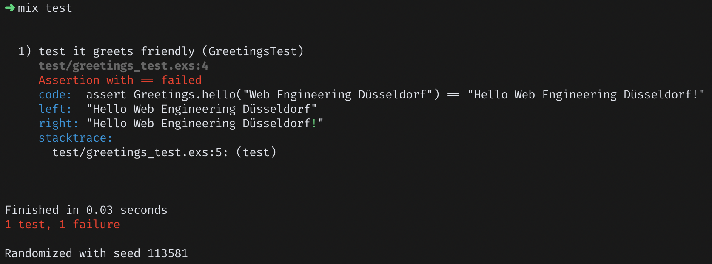
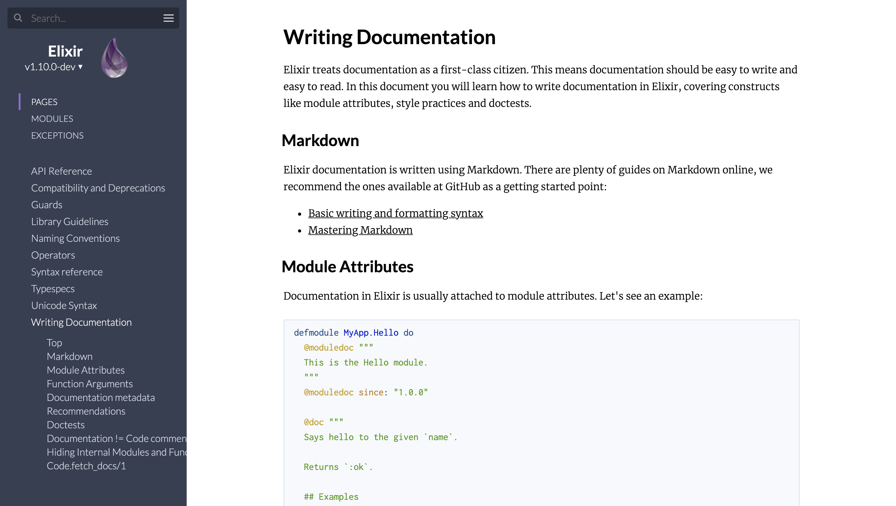
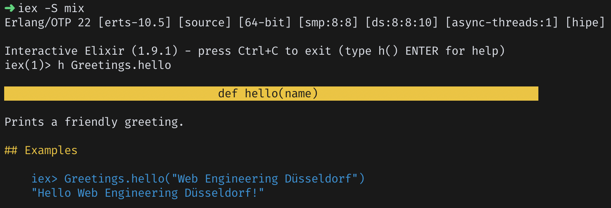
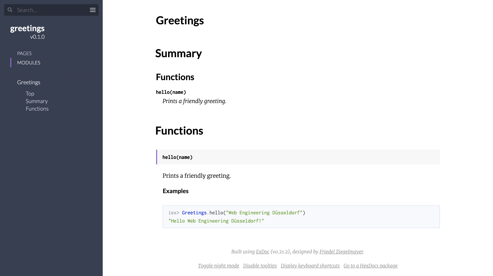
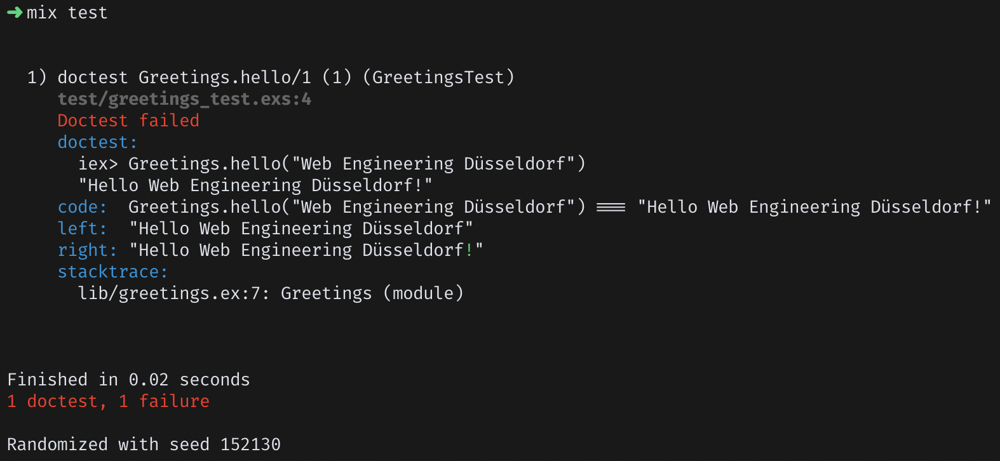

theme: Poster (Quote)
build-lists: true
footer: _`Sascha Wolf | 🐦 wolf4earth | saschawolf.me`_

[.background-color: #1F233D]
[.header-strong: #1F223D]

## The _Essence_
## of **_Elixir_****ll.**

^
Or rather, it's DNA

---
## Hey ho!
## I'm _Sascha_

^
28, Full-Stack, FP-Fan, BetterDoc

---


[.footer: _Image by Gerd Altmann from Pixabay_]
[.footer-style: alignment(right)]

---
# _Agenda_

- _History_ of **_Elixir_**
- _Introduction_ to **_Elixir_**
- _Design Aspects_ of **_Elixir_**
- _Disadvantages_ of **_Elixir_**

^
History: The Why
Syntax: The What
Design: The How

^
Goal: Help you understand "what makes Elixir tick"

---
## What is *Elixir*?

---
# What is *Elixir*?

<br/>
> Elixir is a dynamic, functional language designed for building scalable and maintainable applications.
-- elixir-lang.org

^
Great sales pitch, right?

^
What does that mean in practice?

---
### To understand
## _Elixir_[^1]
### we need to understand its
## _History_

[^1]: and the problems it tries to solve

^
Where does it come from?
What problems does it try to solve?

---
## The year is
# _2012_

^
and a guy named ...

---
# José _Valim_

^
Well-known Rubyist

---
# José _Valim_


__A well-known *Rubyist*__

- _Rails_ 44.2k ⭐ (Contributor)
- _Devise_ 20.2k ⭐
- _Simple Form_ 7.5k ⭐
- And more ...

^
You can say he really likes Ruby

^
He became frustrated with Rubys approach to ...

---
# _Concurrency_

^
CPUs used to get faster, they don't do anymore
Instead: multiple CPUs

---


^
Compared different concurreny models

---
# _Erlang_

---
## _Erlang_ was created
## at _Ericsson_ for
## _telephony switches_

^
People behind it (so you've heard their names)

---

- _Joe_ Armstrong
- _Robert_ Virding
- _Mike_ Williams

^
Looking for a better way to build ...

---
- _Distributed_
- _Fault-tolerant_
- _Soft real-time_
- _High-availability_

^
Similar to todays requirements for bigger systems

^
Looked at a bunch of languages (Lisp, Prolog, Smalltalk)
Nothing quite right

---
## Work on
## _Erlang_ started
## in _1987_

^
With it they created the ...

---
# _AXD301_
# switch


^
Over 1.5 million lines of Erlang

^
One of the most stable products ever released by Ericsson

^
High availability:
9 9s (31ms per year)
More realistic:
5-6 9s (< 5m)

^
In this talk we will explore how!

^
BUT ...

---
```erlang
-module(greetings).
-export([hello/1]).

hello(Name) ->
    io:format("Hello ~s~n", [Name]).
```

^
Syntax: Prolog-inspired
Old language which you notice

^
José saw all that goodness!

---
## ` `Ruby `       ` _Erlang_


^
Ruby = Developer productivity and happiness

^
Erlang = Powerful and battle-hardened concurrency

---


^
But how?

^
Well, Erlang is a compiled language

---
# _BEAM_
#### _Erlang_ VM

^
A VM; just like the JVM

^
And THIS (Erlang)
Became THIS (Elixir)

---
```erlang
-module(greetings).
-export([hello/1]).

hello(Name) ->
    io:format("Hello ~s~n", [Name]).
```

---
```elixir
defmodule Greetings do
  def hello(name) do
    IO.puts("Hello #{name}")
  end
end
```

^
`#{name}` = string interpolation

---
### _Ruby_
#### +
### _Erlang_
#### =
## **_Elixir_**

^
Combining:
Ruby's Expressiveness
Erlang's Robustness and Concurrency

---
## _Introduction_
#### to
## **_Elixir_**

---

<br/>
> _Elixir_ is a dynamic, functional language designed for building scalable and maintainable applications.
-- elixir-lang.org

---
[.text-strong: #626577, League Gothic]

<br/>
> __Elixir is a__ dynamic__, functional language designed for building scalable and maintainable applications.__
-- elixir-lang.org

^
Strong, dynamic typing

---
[.text-strong: #626577, League Gothic]

<br/>
> __Elixir is a dynamic,__ functional __language designed for building scalable and maintainable applications.__
-- elixir-lang.org

^
What defines a functional programming language?

^
First-class functions? = Java
Pure functions? != OCaml? Clojure?

---
# _Functional_ Language

<br/>
> Avoid mutation and side effects.
-- Richard Feldmann[^1]

[^1]: https://youtu.be/QyJZzq0v7Z4

^
How well does the language support this style?

^
How to avoid mutation?

---
# _Immutability_

^
Let's look at a simple example

---
```ruby
my_list = [1, 2, 3]
my_list.concat([4, 5, 6])
puts(my_list.inspect)


=> [1, 2, 3, 4, 5, 6]
```

^
Same piece of code in Elixir

---
```elixir
my_list = [1, 2, 3]
Enum.concat(my_list, [4, 5, 6])
IO.inspect(my_list)


=> [1, 2, 3]
```

^
What you actually need to do

---
```elixir
my_list = [1, 2, 3]
my_list2 = Enum.concat(my_list, [4, 5, 6])
IO.inspect(my_list2)


=> [1, 2, 3, 4, 5, 6]
```

^
Some of you might now ask themselves:

---
# But _why_?

^
Highest source of concurrency bugs?

^
Erlang highly concurrent
Concurrency + Immutability = Perfect Match

^
There is some mutation (later!)

---
```elixir
my_list = [1, 2, 3]
my_list2 = Enum.concat(my_list, [4, 5, 6])
my_list3 = Enum.concat(my_list2, [7, 8, 9])
IO.inspect(my_list3)


=> [1, 2, 3, 4, 5, 6, 7, 8, 9]
```

^
Variables all over the place = annoying

^
(actually what Erlang code looks like)

---
### Enter the
## _Pipe_
### Operator

---
```elixir
[1, 2, 3]
|> Enum.concat([4, 5, 6])
|> Enum.concat([7, 8, 9])
|> IO.inspect()


=> [1, 2, 3, 4, 5, 6, 7, 8, 9]
```

---
## What about
# _Performance_

^
Optimizations: pointing to old data (can't change!)

---
# _Syntax_?

^
I had some more slides but BORING

^
Stop me immediately when some language construct is unfamiliar! I'll explain

---
## _Design Aspects_
### of
## _**Elixir**_

---
# _Design Aspects_

- _functional_ language
- _developer_ happiness
- _pattern_ matching
- _syntactic_ macros
- _Erlang_ goodness

^
We already covered "functional"

---
# _Developer_ Happiness

---
[.autoscale: true]

## _Great_ Tooling

- build tool _`mix`_
- code _formatter_
- interactive console (_`iex`_)
- unit testing framework
- first-class _documentation_

^
All maintained by the core team

^
Not gonna talk about `mix` and formatter
iex: Auto-complete, great data inspection, docs, command history etc.

---
## Unit Testing Framework
### _`ExUnit`_

---
[.code-highlight: all]
[.code-highlight: 6]
```elixir
defmodule GreetingsTest do
  use ExUnit.Case, async: true

  test "it greets friendly" do
    assert Greetings.hello("Web Engineering Düsseldorf") ==
             "Hello Web Engineering Düsseldorf!"
  end
end
```

^
`async: true` because code is pure

^
*Highlight change with laser: "!" at the end*

^
Test failure looks like this:

---
[.background-color: #191918]



^
Tells us about the code, the left value, the right value etc.

^
"Knows" we used `==`: How?
Syntactic Macro System - `assert` is a macro

---
# First-Class
# _Documentation_

^
Okay, what does that mean?

---
[.hide-footer]



^
Elixir takes good docs seriously

---
```elixir
defmodule greetings do
  @doc """
  prints a friendly greeting.

  ## examples

      iex> greetings.hello("web engineering düsseldorf")
      "hello web engineering düsseldorf!"
  """
  def hello(name) do
    io.puts("hello #{name}")
  end
end
```

^
First: docs are **not** comments

^
`@doc` is a **module attribute**; basically a module-level constant

^
Can be accessed easily

---
[.background-color: #191918]



^
Neat but not **that** impressive

---
[.hide-footer]



^
All published packages get their docs automatically generated that way
https://hexdocs.pm/

---
[.code-highlight: all]
[.code-highlight: 7-8]
```elixir
defmodule Greetings do
  @doc """
  prints a friendly greeting.

  ## Examples

      iex> greetings.hello("web engineering düsseldorf")
      "hello web engineering düsseldorf!"
  """
  def hello(name) do
    Io.puts("hello #{name}")
  end
end
```

---
```elixir
defmodule GreetingsTest do
  use ExUnit.Case, async: true

  doctest Greetings
end
```

---
[.background-color: #191918]



---
# _Pattern_
# Matching

^
Q: Who here is familiar with pattern matching? (FP-ler should?)

^
Similar: Destructuring?

^
Example: List

---
```elixir
iex> my_list = [3, 1, 4, 1, 5, 9, 2, 6, 5]
iex> [first, second | rest] = my_list
iex> first
3
iex> second
1
iex> rest
[4, 1, 5, 9, 2, 6, 5]
```

^
Example: Map (or Dict/Hash)

---
```elixir
iex> my_map = %{a: 1, b: 2, c: 3}
iex> %{a: a, b: b} = my_map
iex> a
1
iex> b
2
```

^
Example: Strings

---
```elixir
iex> greeting = "Hello Web Engineering Düsseldorf"
iex> "Hello " <> name = greeting
iex> name
"Web Engineering Düsseldorf"
```

^
Usually you think of `=` as the "Assignment Operator"

---
# _`=`_
#### is the
## ~~_Assignment_ Operator~~
## _Match_ Operator

^
Match left side against right side

^
What happens when it can't match?

---
```elixir
iex> "Hello " <> name = "Salut Web Engineering Düsseldorf"
** (MatchError) no match of right hand side value: "Salut Web Engineering Düsseldorf"
    (stdlib) erl_eval.erl:453: :erl_eval.expr/5
    (iex) lib/iex/evaluator.ex:257: IEx.Evaluator.handle_eval/5
    (iex) lib/iex/evaluator.ex:237: IEx.Evaluator.do_eval/3
    (iex) lib/iex/evaluator.ex:215: IEx.Evaluator.eval/3
    (iex) lib/iex/evaluator.ex:103: IEx.Evaluator.loop/1
    (iex) lib/iex/evaluator.ex:27: IEx.Evaluator.init/4
```

---
# TODO:
## Some more slides on Pattern Matching

---
## _Pattern_ Matching
## is _everywhere_

---
```elixir
defmodule Greetings do
  def hello("") do
    hello("anonymous")
  end

  def hello("Web Engineering " <> city) do
    hello("Web Folks from #{city}")
  end

  def hello(name) do
    "Hello #{name}!"
  end
end
```

^
Clauses are "tried" in order of declaration

^
Pretty common pattern (not the stupid greetings):
Multiple clauses matching and calling each other

^
I could talk more about pattern matching but we have limited time ...

---
# _Syntactic_
# Macros

^
Depending on time ...
Q: Macros or high-level patterns?

^
Q: Who knows what that is?
Q2: Who knows what macros are?

---
### Transform the
# _AST_
#### _A_bstract _S_yntax _T_ree

^
C-Macros: Fancy string replacement

^
Languages: Lisp (most well-known), Rust, Elixir, and more
Lisp: Basically write the AST directly

---
```elixir
iex> quote do
...>   IO.puts("Hello " <> name)
...> end
{{:., [], [{:__aliases__, [alias: false], [:IO]}, :puts]}, [],
 [{:<>, [context: Elixir, import: Kernel], ["Hello ", {:name, [], Elixir}]}]}
```

^
Elixir code represented as Elixir data structures

^
Why is this cool?

---
### Use the
##_full power_
### of
## **_Elixir_**

^
Code as data structures => Manipulate it!

^
Let's have an example ...

---
```elixir
defmodule Conditional do
  defmacro if(condition, do: true_block, else: false_block) do
    quote do
      case unquote(condition) do
        true -> unquote(true_block)
        false -> unquote(false_block)
      end
    end
  end
end
```

^
`quote` and `unquote` = string + interpolation for code (AST)

---
```elixir
import Conditional
if Date.utc_today() == ~D[2019-12-12] do
  IO.puts("Meetup time!")
else
  IO.puts("No meetup :("))
end

=> Meetup time!
```

^
Elixir has an `if` and it's a macro
as is the pipe operator

---
```
application/andrew-inset      ez
application/applixware        aw
application/atom+xml        atom
application/atomcat+xml       atomcat
application/atomsvc+xml       atomsvc
application/ccxml+xml       ccxml
application/cdmi-capability     cdmia
application/cdmi-container      cdmic
application/cdmi-domain       cdmid
application/cdmi-object       cdmio
application/cdmi-queue        cdmiq
application/cu-seeme        cu
```

^
Left: Mime Type | Right: Extension

---
```elixir
defmodule MimeType do
  "path/to/mime-types.txt"
  |> File.read!()
  |> Enum.map(fn line ->
    [mime_type, extension] = String.split(line, " ", trim: true)

    def to_extension(unquote(mime_type)), do: unquote(extension)
  end)
end
```

---
```elixir
iex> MimeType.to_extension("application/applixware")
"aw"
```

^
Other examples: Phoenix templates => inlined

---
## **_Elixir_** Macros
## are _hygenic_

^
Hygenic: Variables declared in Macros don't pollute the caller context

^
Example: x in caller, x in macro, doesn't override

---
```elixir
defmodule MyMacros do
  def define_x(value) do
    quote do
      x = unquote(value)
    end
  end
end

iex> import MyMacros
iex> x = 42
iex> define_x(1337) # x = 1337
iex> IO.puts(x)

=> 42
```

^
Macros are very powerful, but ...

---
[.hide-footer]


^
The Community agrees: Use Macros sparingly

^
They can make code imcomprehensible

---
# _Erlang_ goodness

---
# _BEAM_
#### _Erlang_ VM

^
First of all, you can use Erlang code from Elixir

---
# _Code_ Reuse

^
Remember the `greetings` code from earlier?

---
```erlang
-module(greetings).
-export([hello/1]).

hello(Name) ->
    io:format("Hello ~s~n", [Name]).
```

---
```elixir
defmodule Greetings do
  def hello(name) do
    :greetings.hello(name)
  end
end
```

^
A lot of Elixirs std just delegates to Erlang
Example: Enum.reverse

^
Not unlike the state of languages on the JVM

^
Second ...

---
# _Concurrency_

^
The BEAM is "based" on the ...

---
# _Actor_ Model[^2]

[^2]: `Technically almost-actor (https://www.youtube.com/watch?v=_0m0_qtfzLs)`

^
Q: Familiarity

^
Why almost? According to Dr. Carl Hewitt (inventor of the actor model in 1973)
Why? Because Erlang was designed without it's knowledge

---
[.background-color: #ffffff]
[.footer-style: #000000]
[.footer: `source: https://www.brianstorti.com/the-actor-model/`]


^
- Actor = fundamental unit of computation
- Isolation (shared nothing) - immutable data
- Message passing
- Sequential processing

^
When message arrives (one of):
- Create more actors
- Send messages to other actors
- Designate what to do with the next message = Mutate State

---
# _Process_
#### Actor

^
Not OS level process but a lot more lightweight

---
```elixir
pid = spawn(fn ->
  receive do
    {:ping, from} -> send from, :pong
  end
end)
send pid, {:ping, self()}
flush() # Prints all messages in the inbox

=> :pong
```

^
Obviously you don't want to build everything using `spawn`

^
That's why Erlang ships with ...

---
# _OTP_
#### _O_pen _T_elecom _P_latform

---
# _O_pen _T_elecom _P_latform

> If half of Erlang's greatness comes from its concurrency and distribution and the other half comes from its error handling capabilities, then the OTP framework is the third half of it.
-- Learn You Some Erlang for Great Good! (Frederic Trottier-Hebert)[^3]

[^3]: https://learnyousomeerlang.com/what-is-otp

^
OTP provides a framework on how to structure your processes

^
At the core of most Elixir applications

^
Example:

---
# _Database_ Connection

^
What would be tasks?

---
[.text-strong: #1F223D, League Gothic]

# _Database_ Connection
<br/>

- establish a _connection_
- run a _query___*__
- _disconnect_

^
INIT: establish a connection
SYNC: run a query*
ASYNC: disconnect

---
[.build-lists: false]

# _Database_ Connection
<br/>

- establish a _connection_
- run a _query_*
- _disconnect_

<br/><sup>* Usually you would have some kind of checkout/checkin mechanism</sup>

^
OTP Abstraction:

---
# _Gen_Server

^
Name is fitting

---
[.code-highlight: all]
[.code-highlight: 2]
[.code-highlight: 4-8]
[.code-highlight: 10-14]
[.code-highlight: 16-20]
```elixir
defmodule DbConnection do
  use GenServer

  def init(uri) do
    connection = MyDatabase.establish_connection(uri)

    {:ok, connection}
  end

  def handle_call({:query, query}, _from, connection) do
    result = MyDatabase.run_query(connection, query)

    {:reply, result, connection}
  end

  def handle_cast(:disconnect, connection) do
    connection = MyDatabase.close_connection(connection)

    {:stop, :normal, connection}
  end
end
```

^
`use GenServer`: "use" is a macro, injects some boilerplate

^
`init`, `handle_cast`, and `handle_call` are callbacks from the GenServer "behaviour" (interfaces)

---
```elixir
iex> {:ok, pid} = GenServer.start_link(DbConnection, "my-database-uri")

iex> query = "SELECT * FROM users"
iex> GenServer.call(pid, {:query, query})
[ ... ] # List of users

iex> GenServer.cast(pid, :disconnect)
:ok
```

^
Quite boilerplaty, that’s why you often see this ...

---
```elixir
defmodule DbConnection do
  use GenServer

  def start_link(uri) do
    GenServer.start_link(DbConnection, uri)
  end

  def query(pid, query) do
    GenServer.call(pid, {:query, query})
  end

  def disconnect(pid) do
    GenServer.cast(pid, :disconnect)
  end

  # init, handle_call, handle_cast
end
```

---
## What if the
# _Database_
## goes down?

---
# 💥

---
> Let it crash
-- Old _Erlang_ wisdom

^
"Let it crash" refers to processes, ofc don't crash them willi-nilli

---
# _**Let it crash**_

<br/>
> 131 out of 132 bugs are transient bugs
-- Erlang in Anger (which refers here to Jim Gray)[^4]

[^4]: https://www.erlang-in-anger.com

^
__Full quote:__
131 out of 132 bugs are transient bugs (they're non-deterministic and go away when you look at them, and trying again may solve the problem entirely), according to Jim Gray in "Why Do Computers Stop and What Can Be Done About It?"

---
# _Examples_ of transient bugs

- _Network request_ fails
- _File IO_ has a hickup
- Odd _race condition_
- Weird _datetime_ issue
- _Database_j goes down

^
And so on and so forth

^
Myriad reasons why things can break

---
> Let it crash
-- Old _Erlang_ wisdom

^
Can't possibly protect against everything

^
Handle **expected** issues

^
Great, we're very good at bringing everything down! Now what?

---
# _Supervisors_

---
# _Supervisors_

> The supervisor is responsible for starting, stopping, and monitoring its child processes. The basic idea of a supervisor is that it must keep its child processes alive by restarting them when necessary.
-- Erlang Documentation[^5]

[^5]: http://erlang.org/doc/man/supervisor.html#supervision-principles

^
The programmer's version of "have you tried restarting it?"

^
Child Process: Worker or another Supervisor

---
[.background-color: #fff]
[.hide-footer]


^
Strategies: :one_for_one, :one_for_all, :rest_for_one

---
```elixir
defmodule MyApp.Application do
  # See https://hexdocs.pm/elixir/Application.html
  # for more information on OTP Applications
  use Application

  def start(_type, _args) do
    # List all child processes to be supervised
    children = [
      MyApp.Repo,
      MyApp.Endpoint
    ]

    # See https://hexdocs.pm/elixir/Supervisor.html
    # for other strategies and supported options
    opts = [strategy: :one_for_one, name: MyApp.Supervisor]
    Supervisor.start_link(children, opts)
  end
end
```

---
# Standing on the _shoulders_ of _Giants_

- _`Agent`_ - keep and manipulate state
- _`Task`_ - easy asynchronous processing
- _`GenStage`_ - exchange events with back-pressure between producer and consumer processes

---
[.hide-footer]
[.background-color: #ffffff]

# Scaling down with Erlang

[^6]

[^6]: https://livebook.manning.com/book/elixir-in-action-second-edition/chapter-1/43

^
HTTP Server: Cowboy
Server-wide state: ETS / Mnesia / Process
Persistable data: Mnesia (semi serious)
Background jobs: Processes
Serice crash recovery: Supervisors

---
# There's _more_ ...

- remote _debugging_
- built-in support for _node clustering_
- _hot code upgrades_ (upgrade while running)
- great support for _metrics_ and _introspection_
- _..._

---
## A lot of
# _stuff_?

---
### No need to know
## _everything_
### from the start!

---
[.hide-footer]
[.background-color: #ffffff]


^
Phoenix abstracts a **lot** of OTP stuff for you

^
Each request a process

---
# _Disadvantages_
## of
# _**Elixir**_

---
# _Disadvantages_ of _**Elixir**_

<br/>

- Raw _Speed_
- Smallish _Ecosystem_
- Challenging _Hiring_

^
Speed: faster than Ruby, slower than C

^
Ecosystem: REPOS -> 20k Erlang, 36k Elixir, 1.5mi Ruby

^
Hiring: Not many Elixir developers, but it's easy enough to pick up

---
# Raw _Speed_

> "Performance" isn’t a good reason to choose @elixirphoenix.
>
> "I don’t have to use caching for sub 200ms responses" is a _very_ good reason.
-- Devon C. Estes (@devoncestes)

---
# _Summary_

---
# **_Elixir_**

- _functional_ and _dynamically typed_
- focusses on _developer happiness_
- considers _documentation_ a _first-class_ citizen
- provides a full _syntactic macro system_
- stands on the shoulders of giants (_Erlang_/_OTP_)

---
# _Further_ Reading[^3]


[^3]: https://elixir-lang.org/learning.html

---
## _Thank you_
## for listening

---
# _Questions_?