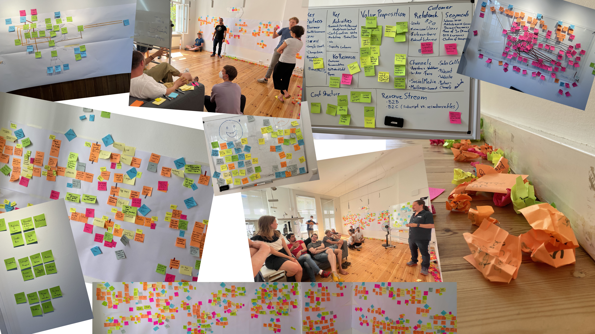

theme: Poster, 1

# _Backend Engineering_
# at 7Mind

---

# Where we _started_

---
[.background-color: #fff]

^
HARD: Change, bug fixing etc.

---
[.background-color: #fff]

# 2021

---

# _Frighteningly_
# Interesting

---

# _Workshops_

---

# _Workshop_ Tools

- Wardley Mapping
- _Event Storming_
- Business Model Canvas
- _Bounded Context Map_
- Core Domain Chart
- _... and more ..._

---

# Where we're _going_

---
[.background-color: #fff]

---
[.background-color: #fff]

# 2025

---

# _Delightfully_
# Boring

---

# _Architecture_

---

# _Modulith_

---

# _Modulith_

1. _Event-driven_ communication
2. _Onion_ architecture (inspired)
3. _DDD_ Bounded Contexts
4. _Build_ Core, _Buy_ Supporting + Generic

---

# Guiding
# _Principle_

^ Started as a joke

---

# _Delightfully_ Boring

1. _Simple_ beats _Complex_ / _Least_ Surprise
2. _Explicit_ beats _Implicit_
3. Isolate _Failure_
4. _Conscious_ Design (_Exploration_)
5. Last _Responsible_ Moment

^ "Make illegal state unrepresentable"

---

# How does that look like
# _in practice_?

---

---

---

---

---

---

---

---

---

---

# Guard
# _Rails_

---

# Guard _Rails_

1. Automation, Automation, Automation
2. _Linting (+Custom Checks)_
3. 100% Code Coverage
4. _PR Reviews (codified)_
5. Ceremonies

^ Surface only
^ Linting: Structured Logs

---

# _Roadmap_

---

# _Roadmap_

- Better _local dev experience_
- More _compile time checks_
- Infrastructure-as-Code _deployments_
- Contentful-based _code generation_
- Test-enforced _API Contracts_
- Cross-stack _observability_

---

# Thank You
# _For Listening_!
### 👍 _Like_ and _Subscribe_ ❤️

---

# _Ceremonies_

---

# _Ceremonies_

- Bug Sheriff
- _End-of-Week Sync + Demo_
- Architecture JourFixe
- _Maintenance JourFixe_
- Retro

---

# _Automation_

---

# _Automation_

- Deploy on Merge (staging)
- _Deploy on Release (production)_
- Bug Sheriff Rotation
- _Changelog Generation_
- Maintenance Backlog Cleaning
