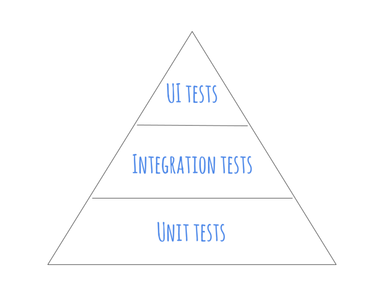
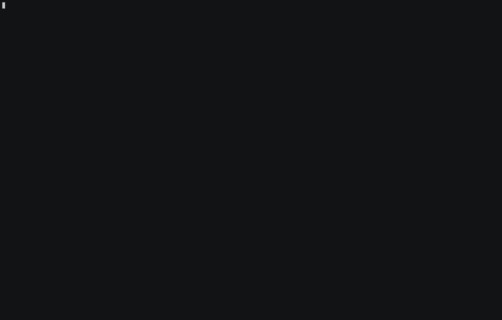

build-lists: true
theme: Courier, 7

# [fit] Template

---

## <insert goal>

---

## I want to take you on a
# journey

---

## Meet Alex
# 👨‍💻

---

# Alex is a developer

---

## He just started at this
# cool company

^
Let's call them ...

---

# Smallcentrix

---

## They are pretty big on
# Clean Code

---

## He starts working
## on his first project

---

## They tell him to
# write tests

^
No experience doing that

---

# :scream:

---


---

## Alex asks himself
# Why?

---

> It costs time!

---

> It's annoying!

---

> I can test manually!

---

## But he starts to write tests

---

## <angry typing gif>?

^
This is ...

---

## It's painful

---

## The tests are brittle

---

## Break with the smallest change

---

## Take a lot of time to maintain

---

## And are hard to read

---

## Alex is frustated

---

# <rage.gif>?

---

## A senior developer
## approaches him

---

# <wizard.gif>?

---

> Let's do this together
-- 🧙‍♂️

---

> Have you heard of the test pyramid?
-- 🧙‍♂️

---

# Test Pyramid

- Few manual tests
- Some Acceptance/UI Tests
- More Integration Tests
- A lot of Unit Tests



---

# Acceptance Tests
## UI Tests

---

# Acceptance/UI Tests

- High-level testing
- Ensure requirements are being fulfilled
- A topic on it's own

^
~10%
Not focussing on this

---

# Integration Tests

---

# Integration Tests

- Test parts working together
- Black box testing
- Have no assumptions about inner workings
- Only test input and output of the system

^
~20%
Relevant, but we'll focus on

---

# Unit Tests

- Test single "units" in __isolation__
- Independent from each other
- Good unit tests act as ...
  + design specifications
  + documentation

^
~70%
You might ask, and Alex does too, ...

---

> What makes a good Unit Test?
-- Alex

---

> To understand that we first have to look at units.
-- 🧙‍♂️

---

> You need to understand how to write testable units.
-- 🧙‍♂️

---

# Example

---

```python
def get_time_of_day():
  now = datetime.now()

  if now.hour >= 0 and now.hour < 6:
    return "night"
  elif now.hour >= 6 and now.hour < 12:
    return "morning"
  elif now.hour >= 12 and now.hour < 18:
    return "afternoon"

  return "evening"
```

---

> Do you see any issues with this code?
-- 🧙‍♂️

---

```python
def get_time_of_day():
  now = datetime.now()

  if now.hour >= 0 and now.hour < 6:
    return "night"
  elif now.hour >= 6 and now.hour < 12:
    return "morning"
  elif now.hour >= 12 and now.hour < 18:
    return "afternoon"

  return "evening"
```

---

> How might a test for this function look like?
-- 🧙‍♂️

---

```python


class TestGetTimeOfDay(unittest.TestCase):
  def test_returns_morning_at_6am(self):
    # How to specify 6am?
    self.assertEqual(get_time_of_day(), "morning")
```

---
[.background-color: #0f0f0f]


---

> Do you see the problem?
-- 🧙‍♂️

---

```python
def get_time_of_day():
  now = datetime.now()

  if now.hour >= 0 and now.hour < 6:
    return "night"
  elif now.hour >= 6 and now.hour < 12:
    return "morning"
  elif now.hour >= 12 and now.hour < 18:
    return "afternoon"

  return "evening"
```

---

```python, [.highlight: 2]
def get_time_of_day():
  now = datetime.now()

  if now.hour >= 0 and now.hour < 6:
    return "night"
  elif now.hour >= 6 and now.hour < 12:
    return "morning"
  elif now.hour >= 12 and now.hour < 18:
    return "afternoon"

  return "evening"
```

---

> How can we resolve this issue?
-- 🧙‍♂️

---

```python, [.highlight: 2]
def get_time_of_day():
  now = datetime.now()

  if now.hour >= 0 and now.hour < 6:
    return "night"
  elif now.hour >= 6 and now.hour < 12:
    return "morning"
  elif now.hour >= 12 and now.hour < 18:
    return "afternoon"

  return "evening"
```

---

```python, [.highlight: 2]


def get_time_of_day(datetime):
  if datetime.hour >= 0 and datetime.hour < 6:
    return "night"
  elif datetime.hour >= 6 and datetime.hour < 12:
    return "morning"
  elif datetime.hour >= 12 and datetime.hour < 18:
    return "afternoon"

  return "evening"
```

---

> Testing is easy now.
-- 🧙‍♂️

---

```python


class TestGetTimeOfDay(unittest.TestCase):
  def test_returns_morning_at_6(self):
    now = datetime.now()
    today_at_6 = datetime(now.year, now.month, now.day, 6)
    time_of_day = get_time_of_day(today_at_6)

    self.assertEqual(time_of_day, "morning")
```

---

> Well, that's neat.
-- Alex

^
But ...

---

> How do I make sure to write code like that?
-- Alex

---

> It's called the ...
-- 🧙‍♂️

---

# Single
# Responsibility
# Principle

^
It's actually quite simple

---

> A class [or function] should have only one reason to change.
-- Robert C. Martin[^1]

[^1]: Agile Software Development, Principles, Patterns, and Practices

---

```python
def get_time_of_day():
  now = datetime.now()

  if now.hour >= 0 and now.hour < 6:
    return "night"
  elif now.hour >= 6 and now.hour < 12:
    return "morning"
  elif now.hour >= 12 and now.hour < 18:
    return "afternoon"

  return "evening"
```

---

> The same holds true for tests.
-- 🧙‍♂️

----

> A test should only have __one logical assumption__.
-- 🧙‍♂️

^
What does that mean? It should cover a "particular behaviour" of your code

---

## <example>?

---

> Let's look at another potential issue.
-- 🧙‍♂️

---

# Side Effects

^
Ask for definition

---

# Example

---

```python


class AlarmController:
  def motion_detected(self, datetime):
    if AlarmController.is_night(datetime):
      AlarmSiren.get_instance().activate()

  @staticmethod
  def is_night(datetime):
    return get_time_of_day(datetime) == "night"
```

^
`AlarmSiren` is a singleton

---

```python


class AlarmControllerTest(unittest.TestCase):
  def setUp(self):
    self.alarm_controller = AlarmController()

  def test_motion_detected_at_2_activates_alarm(self):
    self.alarm_controller.motion_detected(today_at(2))

    # How to test that the alarm went off?
    self.assertTrue(False)
```

---

> Any ideas on
> how to do this?
-- 🧙‍♂️

^
Next slide is solution

---

```python
class AlarmController:
  def __init__(self, alarm):
    self.alarm = alarm

  def motion_detected(self, datetime):
    if AlarmController.is_night(datetime):
      self.alarm.activate()

  @staticmethod
  def is_night(datetime):
    return get_time_of_day(datetime) == "night"
```

---

```python
class FakeAlarm:
  activated = False

  def activate(self):
    self.activated = True


class AlarmControllerTest(unittest.TestCase):
  def setUp(self):
    self.alarm = FakeAlarm()
    self.alarm_controller = AlarmController(self.alarm)

  def test_motion_detected_at_2_activates_alarm(self):
    now = datetime.now()
    today_at_2 = datetime(now.year, now.month, now.day, 2)
    self.alarm_controller.motion_detected(today_at_2)

    self.assertTrue(self.alarm.activated)
```

---

> That's cool!
> You removed the coupling!
-- Alex

---

> Yes, we call this __dependency injection__.
-- 🧙‍♂️

---

> It's one way of doing ...
-- 🧙‍♂️

---

# Inversion
## of
# Control

---

> Another way are __higher-order functions__.
-- 🧙‍♂️

---

> a higher-order function ... takes one or more functions as arguments.
-- Wikipedia[^2]

[^2]: https://en.wikipedia.org/wiki/Higher-order_function

---

```python


class AlarmController:
  def motion_detected(self, datetime, alarm_function):
    if AlarmController.is_night(datetime):
      alarm_function()

  @staticmethod
  def is_night(datetime):
    return get_time_of_day(datetime) == "night"
```

---

```python


class AlarmControllerTest(unittest.TestCase):
  def setUp(self):
    self.alarm_triggered = False
    self.alarm_controller = AlarmController()

  def trigger_alarm(self):
    self.alarm_triggered = True

  def test_motion_detected_at_2_activates_alarm(self):
    self.alarm_controller.motion_detected(today_at(2), self.trigger_alarm)

    self.assertTrue(self.alarm_triggered)
```

---

> Let us summarize.
-- 🧙‍♂️

---

# Summary

- Single Responsibility Principle
- Side Effects / Side Causes
- <PURE FUNCTIONS>
- Testing units in isolation
- And of course Don't Repeat Yourself

---

> Of course, there are a lot more things.
-- 🧙‍♂️

---

> Writing good tests is not easy.
-- 🧙‍♂️

---

> But it's worth the effort.
-- 🧙‍♂️

---

# We gain

- Composable units
- Behaviour specifications (basically a contract)
- Refactoring safety

---

> Is there something I can do to make writing tests more easy?
-- Alex

---


---

# TDD
### Test Driven Development

---

# The cycle of TDD

1. Write a test for a new function or behaviour
2. Run all tests and see if the new test fails
3. Write __minimal__ code which satisfies the test
4. Run all tests and see if the new test succeeds
5. Refactor code and tests

---

### 1. Write a test for a new function or behaviour

*Forces us to ...*

- think about how the function should be used, putting design first
- make the function testable from the start

---

# Example - Test

```python


class TestGetTimeOfDay(unittest.TestCase):
  def test_returns_morning_at_6(self):
    now = datetime.now()
    today_at_6 = datetime(now.year, now.month, now.day, 6)
    time_of_day = get_time_of_day(today_at_6)

    self.assertEqual(time_of_day, "morning")
```

---

### 2. Run all tests and see if the new test fails

*Ensures that ...*

- the behaviour has not yet been implemented
- the test is not flawed and passes always

---
[.background-color: #0f0f0f]


---

### 3. Write minimal code which satisfies the test

*Encourages that ...*

- no untested code is being added
- the tests actually provide meaningful documentation

---

# Example - Implementation

```python


def get_time_of_day(datetime):
  return "morning"
```

---

### 4. Run all tests and see if the new test succeeds

^
Rather obvious, needs no elaboration

---
[.background-color: #0f0f0f]



---

### 5. Refactor code and tests

*Allows us to ...*

- make the code easier to read
- modify with ease, since everything is covered by tests

__Always refactor! If your new code is fine as it is, then refactor something nearby!__

__Leave the code a bit cleaner than you found it!__

---

# Example - Test

```python
def today_at(hour):
  now = datetime.now()

  return datetime(now.year, now.month, now.day, hour)

class TestGetTimeOfDay(unittest.TestCase):
  def test_returns_morning_at_6(self):
    time_of_day = get_time_of_day(today_at(6))

    self.assertEqual(time_of_day, "morning")
```

---

# Rinse
## and
# Repeat

---

## But now
# Let's Code