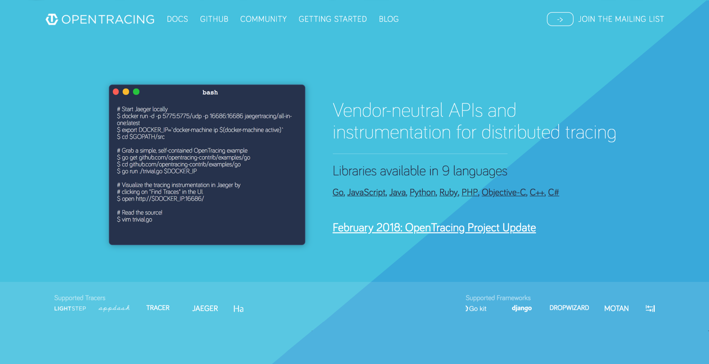
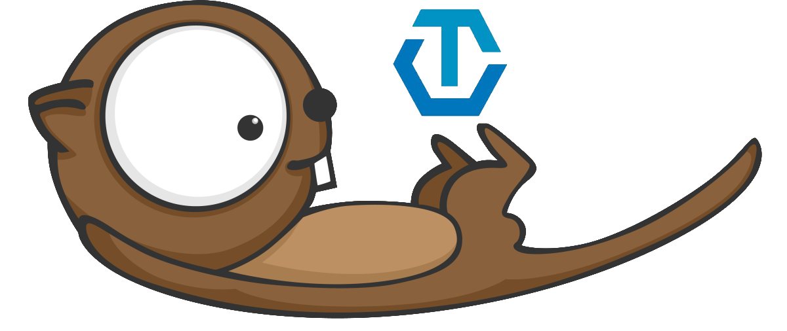
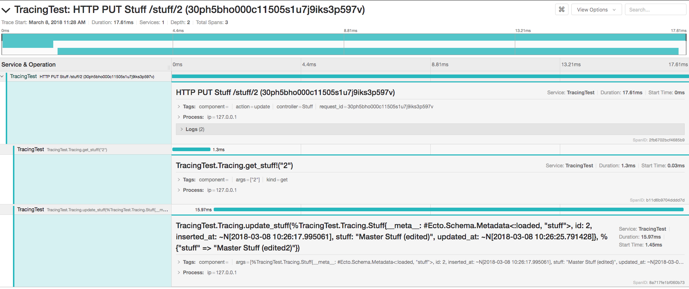

theme: Poster, 1

# Tracing
### *In Elixir*

---
[.autoscale: true]

# Hero's Journey

1. The journey begins with the introduction of the Heroes in the Ordinary World, where
2. they are presented with the Call to Adventure.
3. Their initial reluctance may lead to Refusal of the Call, but they
4. receive encouragement from a Mentor to
5. cross over the Threshold and gain entry into the Special World.
6. There, they encounter Tests, Allies, and Enemies.
7. They Approach the Inmost Cave where
8. they must endure an Ordeal.
9. The Reward is seized and
10. they are pursued as they follow The Road Back to the Ordinary World.
11. They are transformed by the experience of a Resurrection and
12. return triumphant with the Elixir—an item of great value that will benefit the Ordinary World.

^
1. "random" backend developer in a "random" company using Elixir
2. "We need more diagnostics in the backend!"
  - event sourced, cqrs (commanded), phoenix
3. What options are there? What can I use?
4. "Look into OpenTracing, you must"
5. OpenTracing: Vendor-neutral APIs and instrumentation for distributed tracing
6. Otter, ExRay more?
7. "Woho! Working Proof of Concept!"
8. Integrate tracing without much code changes?
  - Carriers in OpenTracing, no support in Otter
  - Global State? ets table? When to clean
  - Solution: Per-Process Span stack
9. Request -> Command
10. "What about Command -> Command and Command -> Projection?"
11. "Carrier"-like: Injected trace IDs into command/event metadata
12. Trace: Request -> Command -> Projections / Commands (?)

---

# Let's meet *Alexander*

---

# 👨‍💻

^
Backend Developer at a random compomany, let's say

---

# **Smallcentrix**

---

> We need more diagnostics!
-- Pretty much everybody

---


^
- elixir diagnostics (Healthcare)
- elixir tracing

---

# 🤷‍♂️

^
- Where to start? What makes sense?
- Ask experienced colleague, Senior Developer, if you want

---

# 🧙‍♂️

---

> Look at OpenTracing, you scrub!
-- 🧙‍♂️

^
Pretty much the exchange

^
"Before we look at OT, let's ask ourselfs ..."

---

# What exactly
# *is* tracing?

^
Question!

^
"Tracing is about ..."

---

# Analyzing
# Transactions

^
"But ..."

---

# Tracing
# is *hard*

^
Question: Why?

---

- Contexts need to be passed around
- Within and between processes
- Through OSS packages (ORM etc.)
- Self-contained services (NGINX, Redis etc.)
- Arbitrary glue code and business logic

^
Unreasonable to abide to single vendor specifications

---

# Vendor
# Lock-in

---



^
Not going to explain OT in detail, couldn't do it anyway

---

## Timed Operations
#### called *Spans*

---

## Relations between
## *Spans*

---

## Context Propagation

^
Getting Span information from one system into another

^
"For this OpenTracing standardizes ..."

---

- Span management (start, finish, decorate)
- Inter-process propagation (overcome process boundaries)
- Active span management (store, retrieve)

^
"Ok, so this is OpenTracing ..."

---

# What about Elixir?

---

# OTTER
#### *O*pen*T*racing *T*oolkit for *Er*lang



---

## Partial
## OpenTracing
## Implementation

---

- Span management (start, finish, decorate)
- Kinda: Active span management

^
Active: Per-Process span "caching", not crossing process boundaries

---

# ExRay
#### Tracing annotations built with OTTER


---

```elixir
defmodule Stuff do
  use ExRay, pre: :start_span, post: :finish_span

  defp start_span(context), do: ...
  defp finish_span(context, span, result), do: ...

  @trace kind: "list"
  def list_stuff do
    Stuff.Repo.all(Stuff)
  end

  ...
end
```

---

# Remember Alexander?

---

## He built a
## Proof of Concept

---



^
Screenshot from Jaeger UI, distributed tracing system by Uber

---

# 🎉🎉🎉

^
Everybody was like "Yeeeaaaah"

---

## Integrate it
## into the project!

^
Must be easy now, right?

---

# Tracing Plug

^
1. Create span and add some tags
2. Wait for response
3. Finish span

---

# 🎉🎉🎉

^
Let's go deeper ...

^
"But then Alexander ..."

---


^
"The project was ..."

---

# Event-driven

---

## How to cross
## system boundaries?

^
Remember what OTTER provides us with?

---

- Span management (start, finish, decorate)
- Kinda: Active span management

---

## What about
## inter-process
## propagation?

^
"Well ..."

---

# 💩

---

# How did 👨‍💻 solve this?

---

## Inserted Span IDs
## into event metadata

^
Used those downstream to correlate the spans to each other